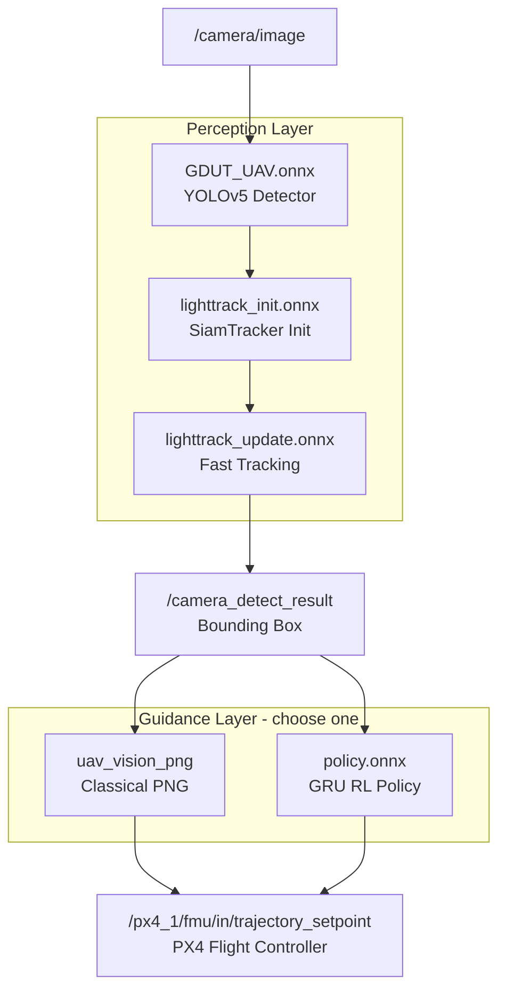

# Autonomous Intercept Drone — AI/ML Models

ဤ Project တွင် အသုံးပြုထားသော **AI/ML Model စုစုပေါင်း (၆) ခု** ရှိပါသည်။

---

## ၁။ အကျဉ်းချုပ် ဇယား (Quick Summary)

| Model အမည် | အရွယ်အစား | အဓိက တာဝန် | အသုံးပြုသည့် Code File | အခြေအနေ |
|---|:---:|---|---|:---:|
| **`GDUT_UAV.onnx`** | 28 MB | ပစ်မှတ် ရှာဖွေခြင်း (YOLOv5) | [uav_topic_subscrib.cpp](file:///home/hmue_gyi/Desktop/Git/Autonomous_Intercept_Drone/uav_vision_dectect/src/uav_topic_subscrib.cpp#L13) | 🟢 သုံးသည် |
| **`lighttrack_init.onnx`** | 4.8 MB | Tracking စတင်ခြင်း (Template Init) | [LightTrack.cpp](file:///home/hmue_gyi/Desktop/Git/Autonomous_Intercept_Drone/uav_vision_dectect/src/LightTrack.cpp#L93) | 🟢 သုံးသည် |
| **`lighttrack_update.onnx`** | 7.6 MB | အမြန် ခြေရာခံခြင်း (Fast Track) | [LightTrack.cpp](file:///home/hmue_gyi/Desktop/Git/Autonomous_Intercept_Drone/uav_vision_dectect/src/LightTrack.cpp#L94) | 🟢 သုံးသည် |
| **`policy.onnx`** | 253 KB | ကြားဖြတ်လမ်းညွှန်မှု (RL Guidance) | [rl_guidance_node.cpp](file:///home/hmue_gyi/Desktop/Git/Autonomous_Intercept_Drone/uav_rl_guidance/src/rl_guidance_node.cpp#L341) | 🟢 သုံးသည် |
| **`drone_v1200.onnx`** | 27 MB | အရန် YOLO မော်ဒယ် | - | ⚪ အရန် (Spare) |
| **`policy.pt`** | 267 KB | PyTorch Checkpoint | [export_onnx.py](file:///home/hmue_gyi/Desktop/Git/Autonomous_Intercept_Drone/uav_rl_guidance/src/export_onnx.py#L19) | 🔵 မူရင်း Source |

---

## ၂။ Model များ အလုပ်လုပ်ပုံ အဆင့်ဆင့် (System Architecture)

---

## ၃။ Model တစ်ခုချင်းစီ၏ ရှင်းလင်းချက်

### `GDUT_UAV.onnx` — YOLOv5 Detector

| အချက် | အသေးစိတ် |
|---|---|
| **ဖိုင်** | [`model/yolov5/GDUT_UAV.onnx`](file:///home/hmue_gyi/Desktop/Git/Autonomous_Intercept_Drone/uav_vision_dectect/model/yolov5/GDUT_UAV.onnx) (28 MB) |
| **တာဝန်** | ကင်မရာ Frame ထဲတွင် Target Drone ရှာဖွေ၊ Bounding Box ထုတ်ပေးသည် |
| **Input / Output** | `[1, 3, 640, 640]` → Bounding Box `(x, y, w, h)` |
| **Code** | [`uav_topic_subscrib.cpp#L13`](file:///home/hmue_gyi/Desktop/Git/Autonomous_Intercept_Drone/uav_vision_dectect/src/uav_topic_subscrib.cpp#L13) path, [`#L140`](file:///home/hmue_gyi/Desktop/Git/Autonomous_Intercept_Drone/uav_vision_dectect/src/uav_topic_subscrib.cpp#L140) detect(), [`yolo_detector.cpp#L24`](file:///home/hmue_gyi/Desktop/Git/Autonomous_Intercept_Drone/uav_vision_dectect/src/yolo_detector.cpp#L24) load |

---

### `lighttrack_init.onnx` & `lighttrack_update.onnx` — SiamTracker

| အချက် | အသေးစိတ် |
|---|---|
| **ဖိုင်** | [`model/light_track/`](file:///home/hmue_gyi/Desktop/Git/Autonomous_Intercept_Drone/uav_vision_dectect/model/light_track/) (init 4.8 MB, update 7.6 MB) |
| **တာဝန်** | YOLO တွေ့ပြီးနောက် Frame တိုင်း YOLO ထပ်မ run ဘဲ High FPS ဖြင့် ပစ်မှတ် ဆက်တိုက် track လုပ်သည် |
| **Init Input/Output** | `[1, 3, 127, 127]` → Template Feature `[1, 96, 8, 8]` (တစ်ကြိမ်သာ run) |
| **Update Input/Output** | Template + `[1, 3, 288, 288]` → Cls Map + Reg Map (Frame တိုင်း run) |
| **Code** | [`uav_topic_subscrib.cpp#L51`](file:///home/hmue_gyi/Desktop/Git/Autonomous_Intercept_Drone/uav_vision_dectect/src/uav_topic_subscrib.cpp#L51) init, [`#L187`](file:///home/hmue_gyi/Desktop/Git/Autonomous_Intercept_Drone/uav_vision_dectect/src/uav_topic_subscrib.cpp#L187) init(), [`#L204`](file:///home/hmue_gyi/Desktop/Git/Autonomous_Intercept_Drone/uav_vision_dectect/src/uav_topic_subscrib.cpp#L204) track(), [`LightTrack.cpp#L93`](file:///home/hmue_gyi/Desktop/Git/Autonomous_Intercept_Drone/uav_vision_dectect/src/LightTrack.cpp#L93) load |

---

### `policy.onnx` — GRU RL Guidance Policy

| အချက် | အသေးစိတ် |
|---|---|
| **ဖိုင်** | [`models/policy.onnx`](file:///home/hmue_gyi/Desktop/Git/Autonomous_Intercept_Drone/uav_rl_guidance/models/policy.onnx) (253 KB) |
| **တာဝန်** | Interceptor Drone အတွက် အကောင်းဆုံး ဦးတည်ရာ velocity ကို ခန့်မှန်းပေးသည် |
| **Input / Output** | 15 Observation Features → `(vx, vy, vz, yaw_rate)` |
| **Hit Rate** | Simulation တွင် **97%** |
| **Code** | [`rl_guidance_node.cpp#L344`](file:///home/hmue_gyi/Desktop/Git/Autonomous_Intercept_Drone/uav_rl_guidance/src/rl_guidance_node.cpp#L344) load, [`#L716`](file:///home/hmue_gyi/Desktop/Git/Autonomous_Intercept_Drone/uav_rl_guidance/src/rl_guidance_node.cpp#L716) infer() |

---

### `drone_v1200.onnx` & `policy.pt` — Spare / Source Files

| ဖိုင် | ရည်ရွယ်ချက် |
|---|---|
| [`drone_v1200.onnx`](file:///home/hmue_gyi/Desktop/Git/Autonomous_Intercept_Drone/uav_vision_dectect/model/yolov5/drone_v1200.onnx) | `GDUT_UAV.onnx` နေရာ ၌ အစားထိုးစမ်းသပ်နိုင်သော အရန် YOLO |
| [`policy.pt`](file:///home/hmue_gyi/Desktop/Git/Autonomous_Intercept_Drone/uav_rl_guidance/models/policy.pt) | [`export_onnx.py`](file:///home/hmue_gyi/Desktop/Git/Autonomous_Intercept_Drone/uav_rl_guidance/src/export_onnx.py) ဖြင့် `policy.onnx` ထုတ်ရန် PyTorch မူရင်း |
