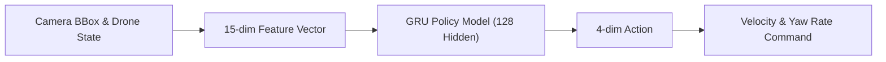
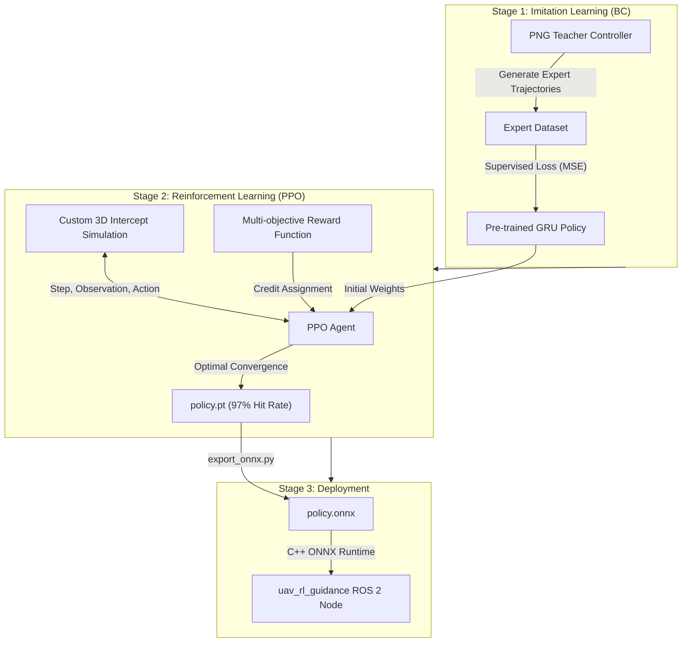
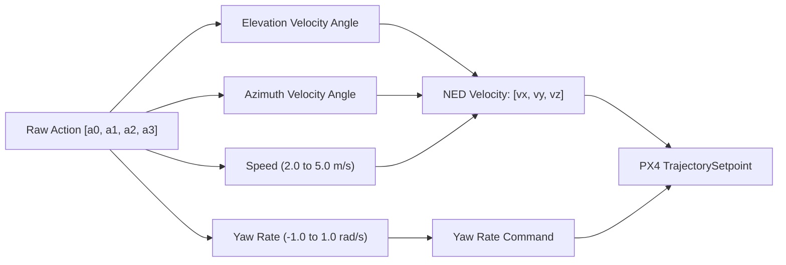

# How to Train Reinforcement Learning (RL) Guidance Model — အစအဆုံး လမ်းညွှန်

> ဤလမ်းညွှန်သည် Interceptor Drone တွင် ပစ်မှတ် Drone အား အလိုအလျောက် လိုက်လံတိုက်ခိုက်ဖမ်းဆီးရန် အသုံးပြုသော **GRU-based Reinforcement Learning (RL) Guidance Model (`policy.pt` / `policy.onnx`)** အား မည်သို့ မည်ပုံ လေ့ကျင့်သင်ကြားထားသည် (Training Strategy, Architecture, Reward Formulation) နှင့် မော်ဒယ်အသစ်အား မည်သို့ Export ပြုလုပ်ပြီး C++ ROS 2 Package တွင် Deploy ပြုလုပ်ရမည်ကို အသေးစိတ် ရှင်းပြထားပါသည်။

---

## ၁။ ခြုံငုံသုံးသပ်ချက် (Overview)

Interceptor Drone ၏ လမ်းညွှန်စနစ် (Guidance Layer) တွင် Classical သင်္ချာနည်းလမ်းဖြစ်သော **Proportional Navigation Guidance (PNG)** အစား ဉာဏ်ရည်တု အခြေပြု **Reinforcement Learning (GRU Policy)** ကို အသုံးပြုထားပါသည်။



| အချက်အလက် | အသေးစိတ်ဖော်ပြချက် |
|---|---|
| **မော်ဒယ်အမျိုးအစား** | Recurrent Neural Network — **GRU (Gated Recurrent Unit)** |
| **လေ့ကျင့်သည့်နည်းလမ်း (Methodology)** | **2-Stage Hybrid Learning**: <br>1. **Behavioral Cloning (BC)** (Supervised Warm-up)<br>2. **PPO (Proximal Policy Optimization)** (RL Fine-tuning) |
| **Observation Input** | **15 Dimensions** (Camera Bounding Box + LOS Angles + Drone Dynamics) |
| **Action Output** | **4 Dimensions Continuous** ($\Delta v_{angle\_v}, \Delta v_{angle\_z}, speed, yaw\_rate$) |
| **Hidden Units** | 1 Layer GRU (Hidden Size: 128) |
| **Inference Framework** | **ONNX Runtime (C++)** — Zero PyTorch runtime dependency |
| **ရရှိထားသော အောင်မြင်မှုနှုန်း** | **97% Hit Rate** (Target Interception Success) |
| **ဖိုင်တည်နေရာများ** | PyTorch Checkpoint: [`uav_rl_guidance/models/policy.pt`](file:///home/hmue_gyi/Desktop/Git/Autonomous_Intercept_Drone/uav_rl_guidance/models/policy.pt)<br>ONNX Model: [`uav_rl_guidance/models/policy.onnx`](file:///home/hmue_gyi/Desktop/Git/Autonomous_Intercept_Drone/uav_rl_guidance/models/policy.onnx)<br>Metadata: [`uav_rl_guidance/models/policy_meta.json`](file:///home/hmue_gyi/Desktop/Git/Autonomous_Intercept_Drone/uav_rl_guidance/models/policy_meta.json) |

---

## ၂။ အဘယ်ကြောင့် RL နှင့် GRU ကို ရွေးချယ်ခဲ့သနည်း?

1. **ရိုးရိုး PNG ထက် ပိုမိုကောင်းမွန်ခြင်း**:
   * ရိုးရိုး Classical PNG သည် ပစ်မှတ် Drone ၏ မမျှော်လင့်သော ရှောင်တိမ်းမှု (Maneuvering)၊ ကင်မရာမှ ခေတ္တပျောက်သွားခြင်း (Occlusion/Visual Loss) သို့မဟုတ် ကင်မရာ Frame အစွန်းသို့ ရောက်ရှိသွားခြင်းတို့ကို အချိန်နှင့်တပြေးညီ ကြိုတင်ခန့်မှန်းနိုင်စွမ်း နည်းပါးသည်။
   * RL Agent သည် ပစ်မှတ် Drone ၏ ပျံသန်းမှုလမ်းကြောင်းကို ကြိုတင်တွက်ချက်ကာ အထိရောက်ဆုံး လမ်းကြောင်းမှ ဖြတ်တောက် intercept ပြုလုပ်နိုင်သည်။

2. **Memory စွမ်းရည် (GRU Recurrent Architecture)**:
   * ဒရုန်းတွင် ရှေ့ကြည့်ကင်မရာ (Monocular Camera) သာ တပ်ဆင်ထားသဖြင့် Depth (အကွာအဝေး အတိအကျ) မသိရှိနိုင်ပါ။
   * GRU (Hidden State 128) သည် ယခင်ရောက်ရှိခဲ့သော Bounding Box အရွယ်အစားပြောင်းလဲမှု၊ ဦးတည်ချက်နှင့် အမြန်နှုန်းမှတ်တမ်း (Historical Trajectory) များကို မှတ်သားထားနိုင်သောကြောင့် **Target မျက်ကွယ်ပျောက်သွားချိန် (Occlusion / Tracking Loss)** တွင်ပင် ပစ်မှတ်ဆက်သွားမည့် ဦးတည်ချက်သို့ စက္ကန့်အနည်းငယ် ဆက်လက်ပျံသန်းနိုင်စွမ်း (Coast Flight) ရှိသည်။

---

## ၃။ လေ့ကျင့်ရေး ပတ်ဝန်းကျင် (Training Environment)

> [!NOTE]
> RL မော်ဒယ်ကို Gazebo / PX4 SITL ပေါ်တွင် တိုက်ရိုက် Train ခြင်း **မဟုတ်ပါ**။ Gazebo ပေါ်တွင် တိုက်ရိုက် Step သန်းပေါင်းများစွာ Train ပါက တွက်ချက်မှုအလွန်နှေးကွေးပြီး ရက်သတ္တပတ်ပေါင်းများစွာ ကြာမြင့်နိုင်ပါသည်။

ထို့ကြောင့် ဤမော်ဒယ်ကို **Custom Fast Python Kinematics Simulation Environment** (AeroIntercept Framework) တွင် လေ့ကျင့်ထားသည်-
* **High-Speed Vectorized Simulation**: 3D Kinematics ညီမျှခြင်းများဖြင့် CPU/GPU ပေါ်တွင် တစ်ပြိုင်နက် Environment အများအပြား (Parallel Envs) ဖြင့် စက္ကန့်ပိုင်းအတွင်း Steps သိန်းချီ လေ့ကျင့်နိုင်ခြင်း။
* **Domain Randomization**: Simulation နှင့် စစ်မှန်သော ကမ္ဘာ (သို့မဟုတ် Gazebo) ကြား ကွာခြားမှု (Sim-to-Real Gap) နည်းပါးစေရန် ပစ်မှတ်၏ မတူညီသော မူလတည်နေရာများ၊ အမြန်နှုန်းအမျိုးမျိုး (0 ~ 7 m/s)၊ လေတိုက်ခတ်မှု (Wind gusts) နှင့် Camera Noise များကို Random ထည့်သွင်း လေ့ကျင့်ထားသည်။

---

## ၄။ နှစ်ဆင့် လေ့ကျင့်သင်ကြားရေး မဟာဗျူဟာ (2-Stage Training Pipeline)



### အဆင့် ၁။ Behavioral Cloning (BC) — Teacher မှ အတုယူ သင်ကြားခြင်း
* **ပြဿနာ**: အစပိုင်းတွင် မော်ဒယ်သည် ဒရုန်းကို မည်သို့ ထိန်းကျောင်းရမည်ကို လုံးဝမသိရှိသောကြောင့် Random Actions များသာ လုပ်ဆောင်နေပြီး ပစ်မှတ်ကို ဝင်တိုက်နိုင်ရန် အလွန်ခဲယဉ်းသည် (Cold-start / Sparse Reward Problem)။
* **ဖြေရှင်းချက်**: သင်္ချာနည်းအရ တိကျစွာ ပျံသန်းနိုင်သော **PNG Teacher** (`png_teacher.py`) ကို အသုံးပြု၍ အောင်မြင်သော ပျံသန်းမှု Data ပေါင်း သိန်းနှင့်ချီ ထုတ်ယူသည်။
* **Supervised Learning**: GRU Policy အား အဆိုပါ Expert Trajectories များအတိုင်း မောင်းနှင်နိုင်စေရန် Mean Squared Error (MSE) Loss ဖြင့် ကြိုတင်လေ့ကျင့်ပေးလိုက်သည်။

### အဆင့် ၂။ PPO (Proximal Policy Optimization) — ကိုယ်တိုင်တိုးတက်စေခြင်း
* Behavioral Cloning ပြီးနောက် မော်ဒယ်သည် အခြေခံ ပျံသန်းမှုရရှိလာသည်။
* ထို့နောက် **PPO (Actor-Critic Framework)** ဖြင့် လေ့ကျင့်ပေးသည်။ ဒရုန်းသည် ပတ်ဝန်းကျင်နှင့် တိုက်ရိုက် ထိတွေ့ကာ ကောင်းမွန်သော ဆုံးဖြတ်ချက်များအတွက် **Reward**၊ ညံ့ဖျင်းသော ဆုံးဖြတ်ချက်များအတွက် **Penalty** ရရှိကာ စွမ်းရည် အမြင့်မားဆုံး အခြေအနေသို့ ရောက်ရှိလာသည်။

---

## ၅။ အာရုံခံ Input အချက်အလက်များ (15-Dimensional Observation)

C++ Node ([`uav_rl_guidance/src/rl_guidance_node.cpp`](file:///home/hmue_gyi/Desktop/Git/Autonomous_Intercept_Drone/uav_rl_guidance/src/rl_guidance_node.cpp)) ရှိ `build_features()` လုပ်ဆောင်ချက်နှင့် 1:1 တူညီစွာ တည်ဆောက်ထားသော Observation Feature (၁၅) ခု ဖြစ်ပါသည်-

| Index | Feature အမည် | ပုံသေနည်း / ဖော်ပြချက် | အဓိပ္ပာယ် နှင့် အသုံးဝင်ပုံ |
|:---:|---|---|---|
| **0** | `los_v` | $\frac{\text{elev}}{\pi / 4}$ | ပစ်မှတ်၏ အပေါ်/အောက် ကြည့်ထောင့် (Elevation Angle) |
| **1** | $\sin(\text{los}_z)$ | $\sin(\text{azimuth})$ | ပစ်မှတ်၏ ဘယ်/ညာ ဦးတည်ရာ ထောင့် sin တန်ဖိုး |
| **2** | $\cos(\text{los}_z)$ | $\cos(\text{azimuth})$ | ပစ်မှတ်၏ ဘယ်/ညာ ဦးတည်ရာ ထောင့် cos တန်ဖိုး |
| **3** | `dlos_v` | $\text{clamp}\left(\frac{\dot{\text{los}}_v}{2.0}, -2.0, 2.0\right)$ | အပေါ်/အောက် ထောင့် ပြောင်းလဲမှုနှုန်း (Elevation Rate) |
| **4** | `dlos_z` | $\text{clamp}\left(\frac{\dot{\text{los}}_z}{2.0}, -2.0, 2.0\right)$ | ဘယ်/ညာ ထောင့် ပြောင်းလဲမှုနှုန်း (Azimuth Rate) |
| **5** | `log_w` | $\frac{\ln(w) - \ln(20)}{2.0}$ | Bounding Box အကျယ် (Log-normalized) |
| **6** | `log_h` | $\frac{\ln(h) - \ln(20)}{2.0}$ | Bounding Box အမြင့် (Log-normalized) |
| **7** | `dlog_w` | $\text{clamp}(\Delta \ln(w) / \Delta t, -2.0, 2.0)$ | BBox အရွယ်အစား ကြီးထွားနှုန်း (အနီးအဝေး ခန့်မှန်းရန်) |
| **8** | `valid_flag` | $1.0$ (တွေ့ရှိ) သို့မဟုတ် $0.0$ (ပျောက်ဆုံး) | လက်ရှိ Frame တွင် ပစ်မှတ် မြင်နေရခြင်း ရှိ/မရှိ |
| **9** | `feat_age` | $\min(\text{age}, 2.0) / 2.0$ | ပစ်မှတ်ကို မမြင်ရတော့ဘဲ ပျောက်ဆုံးနေသော ကြာချိန် |
| **10** | `vx` | $v_x / 8.0$ | Interceptor Drone ၏ North အမြန်နှုန်း |
| **11** | `vy` | $v_y / 8.0$ | Interceptor Drone ၏ East အမြန်နှုန်း |
| **12** | `vz` | $v_z / 8.0$ | Interceptor Drone ၏ Down အမြန်နှုန်း |
| **13** | `v_norm` | $\|v\| / 8.0$ | ဒရုန်း၏ စုစုပေါင်း အမြန်နှုန်း ပမာဏ |
| **14** | `altitude` | $-\text{local}_z / 20.0$ | ဒရုန်း ပျံသန်းနေသော အမြင့်ပေ (Altitude) |

---

## ၆။ Action Space နှင့် အမိန့်ထုတ်ပြန်ပုံ (Action Decoding)

GRU မော်ဒယ်မှ ထုတ်ပေးသော Output သည် $[-1, 1]$ ကြားရှိ Continuous Action Vector ၄ ခု ဖြစ်သည်:

$$a = [a_0, a_1, a_2, a_3] \in [-1, 1]^4$$

C++ Node ရှိ `decode_action()` လုပ်ဆောင်ချက်မှ ၎င်း Action များကို အောက်ပါအတိုင်း တွက်ချက်၍ ဒရုန်းပျံသန်းမှု အမိန့်သို့ ပြောင်းလဲပေးသည်-



1. **Elevation Direction Angle ($v_{angle\_v}$)**:
   $$v_{angle\_v} = \text{clamp}(\text{los}_v + a_0 \times 1.2, -\pi/4, \pi/4)$$
2. **Azimuth Direction Angle ($v_{angle\_z}$)**:
   $$v_{angle\_z} = \text{los}_z + a_1 \times 1.2$$
3. **Flight Speed**:
   $$\text{speed} = 2.0 + (5.0 - 2.0) \times \frac{a_2 + 1.0}{2.0} \quad (\text{Range: } 2.0 \sim 5.0\text{ m/s})$$
4. **Yaw Rate**:
   $$\text{yaw\_rate} = a_3 \times 1.0\text{ rad/s}$$

အဆိုပါ Angles များနှင့် Speed ကို အခြေခံ၍ NED Coordinate Frame Velocity $(v_x, v_y, v_z)$ အဖြစ် တွက်ချက်ကာ PX4 စနစ်သို့ ပေးပို့သည်။

---

## ၇။ ဆုနှင့် ပြစ်ဒဏ် သတ်မှတ်ချက် (Reward Formulation)

PPO Training တွင် အသုံးပြုသော ဘက်စုံ Reward Function သည် အောက်ပါအတိုင်း ဖွဲ့စည်းထားပါသည်:

$$R = R_{\text{terminal}} + R_{\text{distance}} + R_{\text{los\_rate}} + R_{\text{fov}} + R_{\text{action\_smooth}}$$

1. **Terminal Reward ($R_{\text{terminal}}$)**:
   * **Hit Reward (+100.0)**: ပစ်မှတ် Drone အား သတ်မှတ် အချင်းဝက် (Hit Radius $< 0.8\text{m}$) အတွင်း ဝင်တိုက်ထိမိပါက ကြီးမားသော ဆုလာဘ် ရရှိသည်။
   * **Crash/Out-of-bounds Penalty (-50.0)**: မြေပြင်သို့ ပျက်ကျခြင်း သို့မဟုတ် ပျံသန်းမှု ဧရိယာအပြင်ဘက် ကျော်လွန်သွားပါက ဒဏ်ခတ်သည်။
2. **Distance Reduction Reward ($R_{\text{distance}}$)**:
   * ပစ်မှတ်ဆီသို့ တဖြည်းဖြည်း နီးကပ်သွားစေရန် အကွာအဝေး လျော့နည်းသွားမှုနှုန်းအလိုက် Positive Reward ပေးသည်:
   $$R_{\text{distance}} = c_d \times (D_{t-1} - D_t)$$
3. **Line-of-Sight Rate Penalty ($R_{\text{los\_rate}}$)**:
   * ဒရုန်းသည် ပစ်မှတ်အား ကင်မရာအလယ်ဗဟိုသို့ တည့်တည့်ချိန်ထားနိုင်ရန် LOS Angular Rate မြင့်မားပါက အပြစ်ပေးသည်:
   $$R_{\text{los\_rate}} = -c_{los} \times (\dot{\text{los}}_v^2 + \dot{\text{los}}_z^2)$$
4. **Field of View Penalty ($R_{\text{fov}}$)**:
   * ပစ်မှတ်သည် ကင်မရာ Frame အလယ်မှ ဝေးကွာသွားပါက သို့မဟုတ် Frame အပြင်ဘက်သို့ ရောက်ရှိပျောက်ဆုံးသွားပါက Penalty ပေးသည်။
5. **Action Smoothness Penalty ($R_{\text{action\_smooth}}$)**:
   * ဒရုန်း၏ မော်တာများ တုန်ခါမှု မဖြစ်စေရန်နှင့် စွမ်းအင် ချွေတာနိုင်စေရန် ထိန်းချုပ်မှု အမိန့်များ ရုတ်တရက် အပြောင်းအလဲ ကြီးမားပါက ဒဏ်ခတ်သည်။

---

## ၈။ Watchdog နှင့် လုံခြုံရေး အကာအကွယ်စနစ် (Safety Watchdog)

အကယ်၍ RL Model မှ မမျှော်လင့်သော ကိန်းဂဏန်းအမှား ထွက်ပေါ်လာပါက ဒရုန်း ပျက်ကျမှုမဖြစ်စေရန် C++ Node တွင် **Watchdog Mechanism** ထည့်သွင်းထားပါသည်:

| စစ်ဆေးတွေ့ရှိသော အခြေအနေ | Watchdog ၏ အရေးယူဆောင်ရွက်ချက် |
|---|---|
| မော်ဒယ်မှ `NaN` သို့မဟုတ် `Inf` ထုတ်ပေးခြင်း | မော်ဒယ်အမိန့်ကို ချက်ချင်းပယ်ဖျက်ပြီး **Classical PNG Controller** သို့ အလိုအလျောက် ပြောင်းလဲထိန်းချုပ်စေသည်။ |
| တွက်ချက်မှု အမြန်နှုန်း အဆမတန်မြင့်မားခြင်း ($> 1.5 \times \text{speed\_cmd}$) | Safety Limit သို့ ညှပ်ချပြီး PNG သို့ ပြောင်းသည်။ |
| ONNX Inference Runtime Error ဖြစ်ပွားခြင်း | PNG သို့ ပြောင်းလဲပြီး GRU Hidden State အား Reset ပြုလုပ်သည်။ |

> **Latch Mechanism**: Watchdog ဖြစ်ပွားပါက အနည်းဆုံး Frame ပေါင်း ၂၀ (၁ စက္ကန့်ခန့်) အထိ PNG ဖြင့်သာ ဆက်လက် ပျံသန်းစေပြီး၊ အခြေအနေ ပြန်လည် တည်ငြိမ်သွားမှသာ RL မော်ဒယ်ကို ပြန်လည် အသုံးပြုခွင့်ပေးသည်။

---

## ၉။ Model ကို Export ပြုလုပ်ခြင်း နှင့် အသုံးပြုပုံ

RL မော်ဒယ်အသစ်အား Train ပြီးပါက Checkpoint ဖိုင် (`policy.pt`) ကို ONNX အဖြစ် အောက်ပါအတိုင်း ပြောင်းလဲနိုင်ပါသည်-

```bash
# ၁။ uav_rl_guidance လမ်းကြောင်းသို့ သွားပါ
cd /home/hmue_gyi/Desktop/Git/Autonomous_Intercept_Drone/uav_rl_guidance

# ၂။ export_onnx.py script ကို run ပါ
python3 src/export_onnx.py
```

အဆိုပါ Script သည် `models/policy.pt` မှ GRU Weights များကို ဖတ်ယူပြီး `models/policy.onnx` အဖြစ် ထုတ်ပေးမည်ဖြစ်ပြီး Input Shape `[1, 15]` နှင့် Hidden Shape `[1, 1, 128]` တို့ မှန်ကန်မှုရှိမရှိကိုပါ အလိုအလျောက် Sanity Check ပြုလုပ်ပေးပါသည်။

---

## ၁၀။ အနှစ်ချုပ် (Summary)

* **မော်ဒယ်စနစ်**: 15 Observation Features $\rightarrow$ 128-unit GRU $\rightarrow$ 4 Velocity Actions.
* **လေ့ကျင့်မှုနည်းပညာ**: PNG Algorithm ဖြင့် အခြေခံအတုယူစေသော **Behavioral Cloning (BC)** နှင့် အောင်မြင်မှုနှုန်း 97% အထိ ရောက်ရှိစေသော **PPO Reinforcement Learning**.
* **လည်ပတ်ပုံ**: ONNX Runtime အသုံးပြု၍ ROS 2 C++ ပတ်ဝန်းကျင်တွင် 20Hz ဖြင့် ပေါ့ပါးစွာ Run နိုင်ပြီး၊ အရေးပေါ်အခြေအနေများအတွက် Built-in PNG Fallback စနစ် ပါဝင်ပါသည်။
