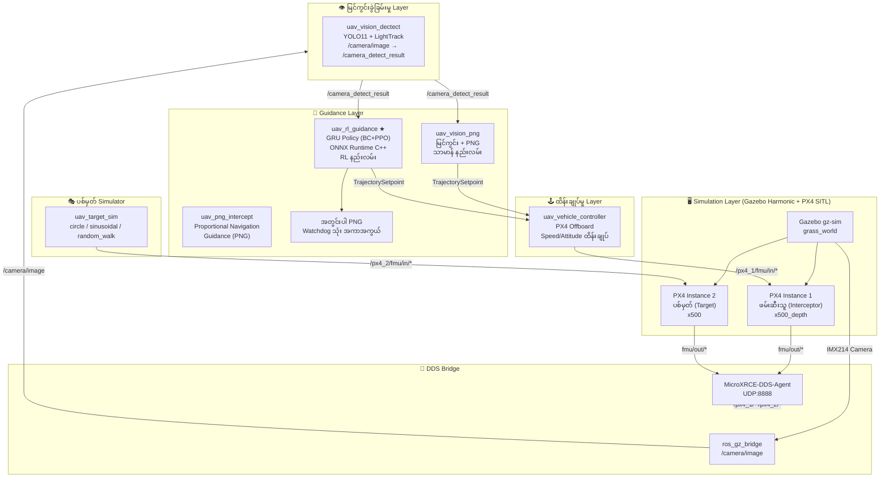
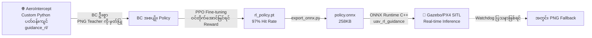
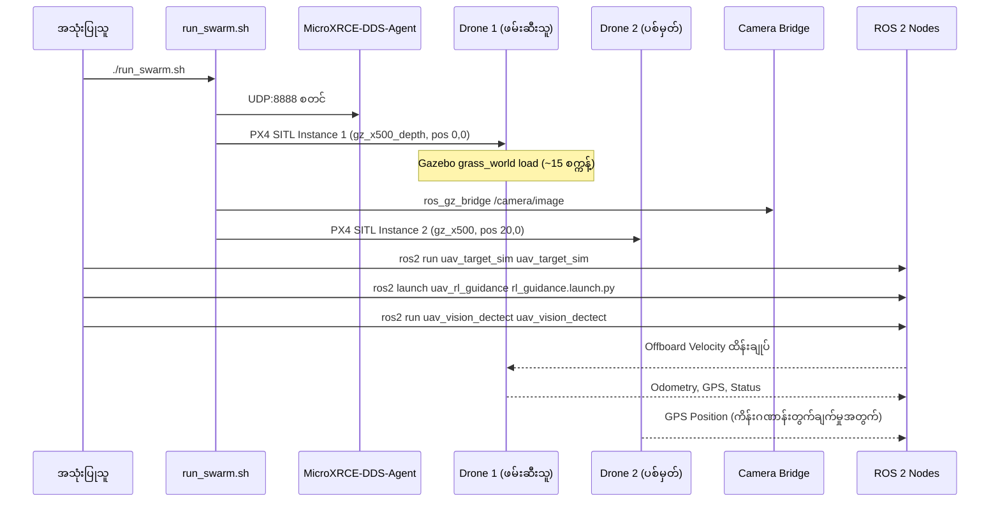
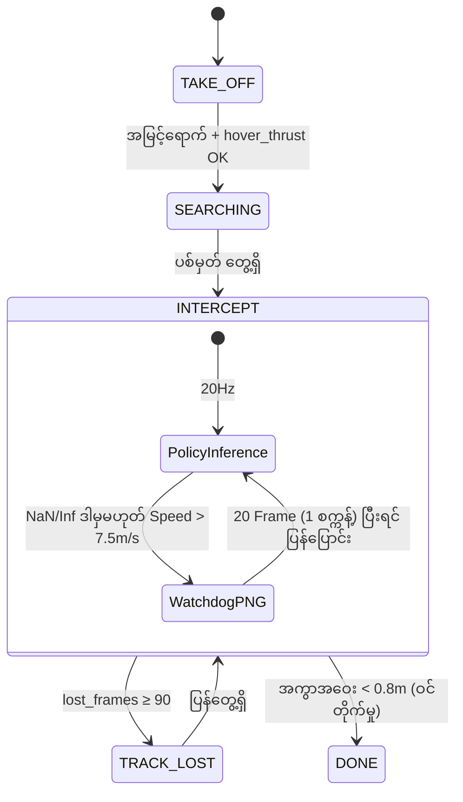

# 🚁 Autonomous Intercept Drone — Repository ခွဲခြမ်းစိတ်ဖြာမှု

> Repo: [Autonomous-Intercept-Drone](file:///home/hmue_gyi/Desktop/Git/Autonomous-Intercept-Drone)  
> ဘာသာစကား: C++ (ROS 2)၊ Python (Training / Export)  
> ခွဲခြမ်းသည့်နေ့: 2026-09-24

---

## ၁။ Project အကျဉ်းချုပ်

**Image-based Visual Servo Autonomous Intercept Drone System**

PX4 + Gazebo + ROS 2 Humble ပတ်ဝန်းကျင်တွင် ड्रोन နှစ်စီး (ဖမ်းဆီးသူ + ပစ်မှတ်) ကို Simulate လုပ်ကာ၊ **မြင်ကွင်းခွဲခြမ်း → လမ်းကြောင်းဆုံးဖြတ် (Guidance) → ပျံသန်းထိန်းချုပ်** ဆိုသည့် ပြည့်စုံသော ကိုယ်တိုင်ကိုယ်ကျ ဝင်တိုက်ရာ Loop ကို အကောင်အထည်ဖော်ထားသည်။

| အချက် | အသေးစိတ် |
|---|---|
| Simulator | **Gazebo Harmonic** (gz-sim 8.12.0) + **PX4 SITL** v1.16 |
| Middleware | **ROS 2 Humble**၊ **MicroXRCE-DDS-Agent** v2.4.x |
| Drone Platform | PX4 X500 (ဖမ်းဆီးသူ: Depth Camera တပ်ဆင်ထား၊ ပစ်မှတ်: သာမာန်) |
| Simulation World | `grass_world` (.sdf) |
| RL Algorithm | **BC + PPO** (Behavioral Cloning ဦးစွာ → PPO Fine-tuning) |
| Training External Repo | **[AeroIntercept](https://github.com/Eaglewzw/AeroIntercept)** |

---

## ၂။ Package ဖွဲ့စည်းပုံ

```
Autonomous-Intercept-Drone/
├── run_swarm.sh              ← Gazebo + PX4 SITL Dual-Drone စတင်ရေး Script
├── px4_msgs/                 ← PX4 ROS 2 Message များ သတ်မှတ်ချက်
├── px4_ros_com/              ← PX4 ↔ ROS 2 ဆက်သွယ်ရေး Utility
├── ros2_helloworld/          ← အခြေခံ နမူနာ
├── uav_bc_recorder/          ← BC Data Recorder (အပြုအမူ ကူးခဲ့ Data စုဆောင်း)
├── uav_common_msg/           ← မျှဝေသော Message အမျိုးအစားများ
├── uav_ibvs_control/         ← [ဟောင်းနွမ်းပြီ] Image-based Visual Servo
├── uav_keyboard_control/     ← လက်ဖြင့် Keyboard ထိန်းချုပ်မှု
├── uav_png_intercept/        ← PNG (Proportional Navigation Guidance) ရိုးစင်းသော နည်းလမ်း
├── uav_rl_guidance/          ← ★ RL GRU Policy အခြေခံ Guidance Node (အဓိက)
├── uav_target_sim/           ← ပစ်မှတ် Drone လှုပ်ရှားမှု Simulator
├── uav_vehicle_controller/   ← PX4 Offboard Speed/Attitude ထိန်းချုပ်မှု
├── uav_vision_dectect/       ← YOLO11 + LightTrack မြင်ကွင်းရှာဖွေမှု
└── uav_vision_png/           ← မြင်ကွင်း + PNG ပေါင်းစပ် Guidance Node (သာမာန် နည်းလမ်း)
```

---

## ၃။ စနစ် ဗိသုကာပုံ (Architecture Diagram)



---

## ၄။ RL (Reinforcement Learning) — ဘယ် Simulation မှာ Train ထားသလဲ?

> [!IMPORTANT]
> RL Policy ကို **ဒီ Gazebo/PX4 Repo နဲ့ သီးခြားဖြစ်သော ပြင်ပ Repo** မှာ Train ထားပါသည်။

### Training ပတ်ဝန်းကျင် အချက်အလက်

| အချက် | အသေးစိတ် |
|---|---|
| **Training Repo** | **[AeroIntercept](https://github.com/Eaglewzw/AeroIntercept)** (ပြင်ပ GitHub) |
| **Training ပတ်ဝန်းကျင် အမျိုးအစား** | **Custom Python Simulation** (Gazebo/PX4 SITL မဟုတ်ပါ) |
| **Training Algorithm** | **BC (Behavioral Cloning)** ဦးစွာ → **PPO** Fine-tuning |
| **Policy ဖွဲ့စည်းပုံ** | **GRU (Gated Recurrent Unit)** Hidden Units 128 ခု |
| **Observation ဆင့်** | 15 ဆင့် (obs_dim=15) |
| **Action ဆင့်** | 4 ဆင့် (act_dim=4) |
| **Checkpoint ပြင်ပ Path** | `/home/verser/Python/guidance_rl/checkpoints/rl_policy.pt` |
| **Train ထားသည့် Hit Rate** | **97%** (policy_meta.json မှတ်တမ်း) |
| **Deploy ပုံစံ** | TorchScript (`.pt`) → ONNX (`.onnx`) ပြောင်းလဲပြီး သုံး |

### Training ပတ်ဝန်းကျင် ဖွဲ့စည်းပုံ (ကုဒ် ခွဲခြမ်းမှုအပေါ် အခြေခံ)

```
guidance_rl/          ← AeroIntercept Repo ထဲတွင် ရှိသော Training ကုဒ်
├── features.py       ← 15-ဆင့် Observation Feature သတ်မှတ်ချက် (C++ နှင့် တစ်ကိုက်)
├── png_teacher.py    ← BC Training အတွက် PNG Teacher အကောင်အထည်ဖော်မှု
└── checkpoints/
    └── rl_policy.pt  ← နောက်ဆုံး Train ပြီးသော Checkpoint
```

### Training Observation Features (15 ဆင့်)

| Index | Feature | ဘာကို ကိုယ်စားပြုသလဲ |
|---|---|---|
| 0 | `los_v` (LOS အပေါ်ကြည့်ထောင့်) | ပစ်မှတ်ရဲ့ Elevation Angle (π/4 ဖြင့် Normalize) |
| 1 | `sin(los_z)` | LOS Azimuth Angle ၏ sin တန်ဖိုး |
| 2 | `cos(los_z)` | LOS Azimuth Angle ၏ cos တန်ဖိုး |
| 3 | `dlos_v` | LOS Elevation Rate — ပစ်မှတ် ဘာနှုန်းနဲ့ အပေါ်/အောက် ရွေ့နေလဲ |
| 4 | `dlos_z` | LOS Azimuth Rate — ပစ်မှတ် ဘာနှုန်းနဲ့ ဘေးရွေ့နေလဲ |
| 5 | `log(bbox_w)` | ပစ်မှတ် Bounding Box ၏ အကျယ် (log, Normalize ပြု) |
| 6 | `log(bbox_h)` | ပစ်မှတ် Bounding Box ၏ အမြင့် (log, Normalize ပြု) |
| 7 | `dlog_w` | Box ကြီးမားနှုန်း ပြောင်းလဲချက် (အနီးအဝေး ခန့်မှန်းနိုင်) |
| 8 | `valid_flag` | ပစ်မှတ် မြင်နေဆဲ ဟုတ်/မဟုတ် (0 သို့မဟုတ် 1) |
| 9 | `age` | ပစ်မှတ် နောက်ဆုံး မြင်ခဲ့ကတည်းက ကြာချိန် |
| 10 | `vx` | ဖမ်းဆီးသူ Drone ကိုယ်တိုင်ရဲ့ North အမြန်နှုန်း |
| 11 | `vy` | ဖမ်းဆီးသူ Drone ကိုယ်တိုင်ရဲ့ East အမြန်နှုန်း |
| 12 | `vz` | ဖမ်းဆီးသူ Drone ကိုယ်တိုင်ရဲ့ Down အမြန်နှုန်း |
| 13 | `v_norm` | ကိုယ်တိုင်ရဲ့ အမြန်နှုန်း scalar |
| 14 | `altitude` | လက်ရှိ ပျံနေသည့် အမြင့် |

### Action Output (4 ဆင့်)

| Index | Action | ပမာဏ |
|---|---|---|
| a[0] | Elevation Angle ချိန်ညှိမှု | ±1.2 rad |
| a[1] | Azimuth Angle ချိန်ညှိမှု | ±1.2 rad |
| a[2] | အမြန်နှုန်း (Speed) | 2.0 ~ 5.0 m/s |
| a[3] | Yaw ပတ်လည်နှုန်း | ±1.0 rad/s |

---

## ၅။ RL Training Pipeline



> [!NOTE]
> **2 အဆင့် Training နည်းဗျူဟာ**: PNG Algorithm ကို Teacher အဖြစ် သုံးပြီး BC ဖြင့် ကူးစား လေ့ကျင့်ကာ၊ ထို့နောက် PPO ဖြင့် ထပ်မံ ကောင်းမွန်အောင် လေ့ကျင့်သော **Imitation → RL** ပုံစံ ဖြစ်သည်။

---

## ၆။ Simulation စတင်မှု အဆင့်ဆင့်



---

## ၇။ ပစ်မှတ် လှုပ်ရှားမှု Mode များ (uav_target_sim)

| Mode | Parameter | လှုပ်ရှားမှု ညီမျှခြင်း | သွင်ပြင်လက္ခဏာ |
|---|---|---|---|
| ဝိုင်းပတ် (မူရင်း) | `circle` | R=5m၊ ω=0.05 rad/s | တည်ငြိမ်သော ဝိုင်းပတ်မှု၊ နယ်နိမိတ် မလိုအပ် |
| Sin Wave ကော | `sinusoidal` | a_y = 0.5·sin(0.5t) m/s² | ရှေ့တိုး 1m/s + ဘေးဘက် Sin ကော အရှိန် |
| ကျပန်း လမ်းလျှောက် | `random_walk` | v(t+Δt) = v(t) + N(0, 0.2) | မမှန်ကန်သော ထွက်ပြေး၊ အများဆုံး 3 m/s |

နယ်နိမိတ် ကန့်သတ်မှု: `max_range` (မူရင်း 10m)၊ 80% ကျော်ရင် ပြန်ဆွဲသော အားထည့်

---

## ၈။ State Machine (RL Node)



---

## ၉။ Watchdog အကာအကွယ် ယန္တရား

| ဖြစ်ပေါ်မှု အကြောင်းရင်း | ကိုင်တွယ်မှု |
|---|---|
| Policy Output တွင် NaN/Inf ပါဝင် | PNG Fallback၊ 20 Frame ဆက်ထိမ်း၊ GRU Hidden State Reset |
| Speed > 1.5 × speed_cmd (7.5 m/s) | တူညီသည် |
| ONNX Runtime Error ဖြစ် | တူညီသည် |

Fallback ကာလ: PNG Controller ထိန်းချုပ်သည်၊ GRU State ဆက်သိမ်းထားသည်၊ 20 Frame ပြီးရင် Policy ပြန်သုံး

---

## ၁၀။ အဓိက File များ လင့်ခ်

| File | လုပ်ဆောင်ချက် |
|---|---|
| [rl_guidance_node.cpp](file:///home/hmue_gyi/Desktop/Git/Autonomous-Intercept-Drone/uav_rl_guidance/src/rl_guidance_node.cpp) | RL Guidance Node ၏ C++ အပြည့်အစုံ အကောင်အထည်ဖော်မှု |
| [export_onnx.py](file:///home/hmue_gyi/Desktop/Git/Autonomous-Intercept-Drone/uav_rl_guidance/src/export_onnx.py) | TorchScript → ONNX ပြောင်းလဲ Script |
| [policy_meta.json](file:///home/hmue_gyi/Desktop/Git/Autonomous-Intercept-Drone/uav_rl_guidance/models/policy_meta.json) | Model Metadata (ဆင့်များ၊ Camera Parameters၊ Hit Rate) |
| [params.yaml](file:///home/hmue_gyi/Desktop/Git/Autonomous-Intercept-Drone/uav_rl_guidance/config/params.yaml) | RL Node Parameter ဆက်တင်များ |
| [uav_target_sim.cpp](file:///home/hmue_gyi/Desktop/Git/Autonomous-Intercept-Drone/uav_target_sim/src/uav_target_sim.cpp) | ပစ်မှတ် လှုပ်ရှားမှု Simulator |
| [run_swarm.sh](file:///home/hmue_gyi/Desktop/Git/Autonomous-Intercept-Drone/run_swarm.sh) | Dual Drone Simulation စတင်ရေး Script |

---

## ၁၁။ အနှစ်ချုပ်

> [!IMPORTANT]
> **RL Policy သည် Gazebo/PX4 SITL ထဲတွင် Train ထားခြင်း မဟုတ်ဘဲ၊ [AeroIntercept](https://github.com/Eaglewzw/AeroIntercept) Repo ၏ Custom Python Simulation တွင် BC+PPO ဖြင့် Train ထားသည်။**

1. **Train ပြုလုပ်သည့်နေရာ** — AeroIntercept Custom Python Simulation (`guidance_rl/`)
2. **Train နည်းလမ်း** — PNG ကို Copy (BC) → PPO ဖြင့် ကောင်းမွန်အောင် ဆက်လုပ်
3. **ရလဒ်** — **97% Hit Rate** (100 ကြိမ်တိုက်ရင် 97 ကြိမ် အောင်မြင်)
4. **Deploy** — ONNX Format ဖြင့် C++ Node တွင် 20Hz Real-time Inference (PyTorch လုံးဝ မလို)
5. **A/B နှိုင်းယှဉ်** — `fallback_png:=true` ဖြင့် PNG Baseline နှင့် တိုင်းတာနိုင်
6. **အကာအကွယ်** — Watchdog ကြောင့် AI မပျက်ရ — PNG ကို အချိန်မရွေး ချက်ချင်း Fallback
