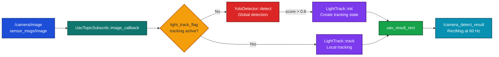
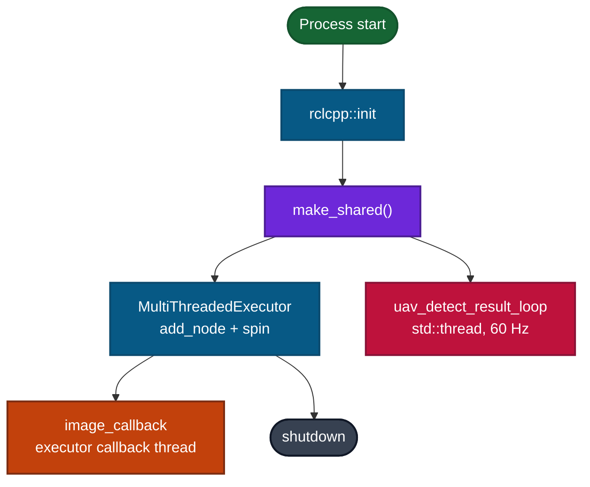
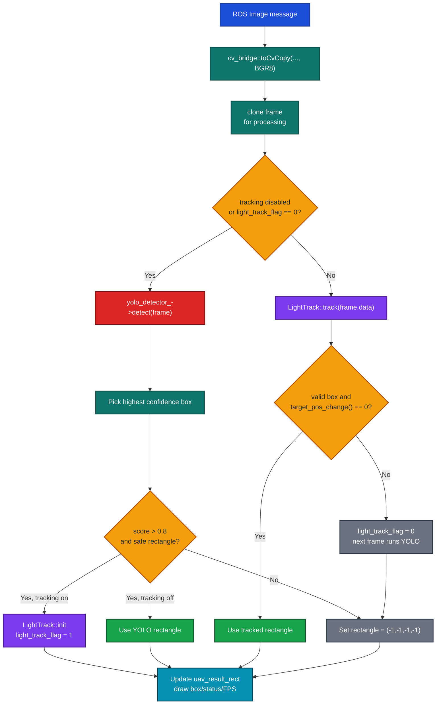

# `uav_vision_dectect` Code Structure ႏွင့္ Function မ်ား

> Package directory ႏွင့္ ROS node name တြင္ `dectect` ဟူေသာ spelling ကို အသုံးျပုထားသည္။ အောက်ပါရှင်းလင်းချက်များသည် လက်ရှိ implementation ကို အခြေခံထားသည်။

## 1. အလုပ်လုပ်ပုံ အကျဉ်းချုပ်

Package သည် `/camera/image` မှ ROS 2 image frame ကို လက်ခံပြီး YOLOv5 ONNX detector ဖြင့် target ကိုပြန်လည်ရှာဖွေသည်။ Target ရရှိပြီးနောက် LightTrack ONNX model ဖြင့် frame တစ်ခုချင်းစီတွင် local tracking လုပ်သည်။ ရလဒ် bounding box ကို `uav_common_msg/msg/RectMsg` အဖြစ် `/camera_detect_result` သို့ 60 Hz ဖြင့် publish လုပ်သည်။

## 2. File ဖွဲ့စည်းပုံ

| File | တာဝန် | အဓိက function / class |
|---|---|---|
| `src/main.cpp` | ROS 2 process စတင်ခြင်း | `main()` |
| `src/uav_topic_subscrib.cpp` | Camera callback, YOLO/LightTrack state machine, result publishing | `UavTopicSubscrib` |
| `src/yolo_detector.cpp` | YOLOv5 ONNX Runtime inference | `YoloDetector` |
| `src/LightTrack.cpp` | Siamese-based local tracker | `LightTrack` |
| `src/uav_control.cpp` | PX4 Offboard position controller | `UavControl` |
| `include/uav_vision_dectect/*.hpp` | ROS node နှင့် detector interface declarations | `UavTopicSubscrib`, `YoloDetector`, `UavControl` |
| `include/light_track/LightTrack.h` | tracker state, parameter, API declarations | `LightTrack` |

`CMakeLists.txt` သည် အထက်ပါ source အားလုံးကို `uav_vision_dectect` executable တစ်ခုထဲသို့ build လုပ်ပြီး OpenCV, ROS 2, ONNX Runtime/CUDA နှင့် link လုပ်သည်။

## 3. ROS Node နှင့် Runtime

### `main.cpp`: `main(int argc, char const *argv[])`

1. `rclcpp::init()` ဖြင့် ROS 2 runtime စတင်သည်။
2. `UavTopicSubscrib` node ကို create လုပ်သည်။
3. `MultiThreadedExecutor` ထဲသို့ node ကိုထည့်ပြီး `spin()` လုပ်သည်။
4. shutdown signal ရသောအခါ `rclcpp::shutdown()` ဖြင့် ပိတ်သည်။

`UavControl` အတွက် create/add-node code နှစ်ကြောင်းကို comment ထားသောကြောင့် လက်ရှိ executable run ချိန်တွင် PX4 offboard controller မအလုပ်လုပ်ပါ။

## 4. `UavTopicSubscrib` Functions

### Constructor: `UavTopicSubscrib::UavTopicSubscrib()`

- Node name ကို `uav_vision_dectect` အဖြစ်သတ်မှတ်သည်။
- Hard-coded LightTrack model base paths နှစ်ခုဖြင့် `LightTrack` instance ဆောက်သည်။
- `initTensorRT()` ကိုခေါ်၍ YOLO detector ကို initialize လုပ်သည်။
- `/camera/image` subscriber ကို `image_callback()` နှင့် ချိတ်သည်။
- `/camera_detect_result` publisher ကို ဆောက်သည်။
- `uav_detect_result_loop()` ကို dedicated thread တစ်ခုဖြင့် စတင်သည်။

### `initTensorRT()`

`DetectorConfig` ကို configure လုပ်သည်: ONNX path, confidence threshold `0.4`, IoU threshold `0.45`, input size `640 x 640`။ ထို့နောက် `std::make_unique<YoloDetector>` ဖြင့် YOLO session ဆောက်သည်။ Exception ဖြစ်လျှင် log ထုတ်ပြီး `yolo_detector_` မရှိသောအခြေအနေကို ဆက်လက်ထားသည်။

### `image_callback(const sensor_msgs::msg::Image::SharedPtr msg)`

Camera frame တစ်ခုလက်ခံတိုင်း အဓိက vision pipeline အားလုံးကိုလုပ်ဆောင်သော function ဖြစ်သည်။

Function အတွင်း state variable များ:

| Variable | အဓိပ္ပါယ် |
|---|---|
| `light_track_flag` | `0` ဆိုလျှင် YOLO global detection လိုအပ်; `1` ဆိုလျှင် LightTrack ကို အသုံးပြုနေသည်။ |
| `enable_tracking` | လက်ရှိ local variable အဖြစ် `true` သတ်မှတ်ထားသည်။ `false` ဖြစ်လျှင် frame တိုင်း YOLO only mode ဖြစ်သည်။ |
| `uav_result_rect` | နောက်ဆုံး valid target rectangle; မတွေ့လျှင် `(-1,-1,-1,-1)` ဖြစ်သည်။ |
| `trackWindow` | YOLO detection ဖြင့် tracker initialization လုပ်စဉ် သိမ်းထားသော rectangle ဖြစ်သည်။ |

### `uav_detect_result_loop()`

`rclcpp::ok()` ဖြစ်နေသရွေ့ 60 Hz ဖြင့် `uav_result_rect` ကို `RectMsg` (`x`, `y`, `width`, `height`, `depth=0`) အဖြစ် `/camera_detect_result` သို့ publish လုပ်သည်။ Header stamp ကို `this->now()` ဖြင့်ထည့်သည်။

### `cxy_wh_2_rect(const cv::Point& pos, const cv::Point2f& sz, cv::Rect& rect)`

LightTrack ကပေးသော center $(c_x,c_y)$ နှင့် size $(w,h)$ ကို OpenCV rectangle သို့ပြောင်းသည်:

$$x = \max(0, c_x - w/2), \quad y = \max(0, c_y - h/2)$$

### Destructor: `~UavTopicSubscrib()`

Result publisher thread ကို `join()` လုပ်ပြီး dynamic allocation ဖြင့်ဆောက်ထားသော `siam_tracker` ကို `delete` လုပ်သည်။

## 5. YOLO Detector: `YoloDetector`

### Constructor: `YoloDetector(const DetectorConfig& config)`

- ONNX Runtime environment/session options ဆောက်သည်။
- CUDA execution provider ကို device `0` အတွက် enable လုပ်ရန်ကြိုးစားသည်; မရလျှင် CPU သို့ fallback လုပ်သည်။
- ONNX model ကို load လုပ်ပြီး model input/output name များကို သိမ်းထားသည်။

### `detect(const cv::Mat& img_raw)`

```mermaid
flowchart LR
	Raw["BGR frame"]:::input --> LB["letterbox\nresize + gray padding"]:::prep
	LB --> RGB["BGR to RGB\nnormalize 0..1\nHWC to CHW"]:::prep
	RGB --> ONNX["ONNX Runtime\nsession.Run"]:::inference
	ONNX --> Parse["Parse anchors\nobject x class confidence"]:::process
	Parse --> Map["Map boxes back\nto original resolution"]:::process
	Map --> NMS["nms\nclass-wise IoU filtering"]:::filter
	NMS --> Detections["vector<Detection>"]:::output

	classDef input fill:#1d4ed8,color:#ffffff,stroke:#1e3a8a,stroke-width:2px;
	classDef prep fill:#0f766e,color:#ffffff,stroke:#134e4a,stroke-width:2px;
	classDef inference fill:#dc2626,color:#ffffff,stroke:#7f1d1d,stroke-width:2px;
	classDef process fill:#7c3aed,color:#ffffff,stroke:#4c1d95,stroke-width:2px;
	classDef filter fill:#f59e0b,color:#1f2937,stroke:#b45309,stroke-width:2px;
	classDef output fill:#16a34a,color:#ffffff,stroke:#14532d,stroke-width:2px;
```

| Function | ရည်ရွယ်ချက် |
|---|---|
| `letterbox()` | Aspect ratio မပျက်စေဘဲ model input size သို့ resize လုပ်ပြီး padding position/ratio ကိုပြန်ပေးသည်။ |
| `detect()` | preprocessing, ONNX inference, anchor output parsing, confidence filtering, coordinate restoration နှင့် NMS ကိုအဆက်မပြတ်လုပ်သည်။ |
| `iou()` | Detection box နှစ်ခု၏ Intersection over Union ကိုတွက်သည်။ |
| `nms()` | confidence အမြင့်မှစပြီး class တူ၍ IoU threshold ကျော်သော overlapping boxes များကိုဖယ်သည်။ |
| `draw()` | Detection list ကို blue box/confidence label ဖြင့် frame ပေါ်တွင်ရေးဆွဲနိုင်သော utility ဖြစ်သည်; callback တွင် custom colors ကိုအသုံးပြုသောကြောင့် မခေါ်ထားပါ။ |

## 6. LightTrack: `LightTrack`

LightTrack သည် YOLO ကပေးသော initial target box ကိုယူပြီး နောက် frame များတွင် target position/size ကိုမြန်ဆန်စွာ update လုပ်သည်။

| Function | ရည်ရွယ်ချက် |
|---|---|
| `LightTrack()` | init/update ONNX model နှစ်ခုကို load လုပ်ပြီး CUDA provider ကိုရွေးချယ်ရန်ကြိုးစားသည်။ |
| `init()` | YOLO box မှ `target_pos`, `target_sz` သတ်မှတ်; exemplar crop ရယူ; init model ဖြင့် feature map `zf_` ထုတ်; Hann window ဆောက်သည်။ |
| `track()` | target အနီးမှ search crop ထုတ်; size scale လုပ်; `update()` ခေါ်; result ကို image boundaries အတွင်း clamp လုပ်သည်။ |
| `update()` | update model inference, classification/bounding-box output parsing, size/ratio penalty, Hann window penalty, နှင့် smoothed position/size update ကိုလုပ်သည်။ |
| `target_pos_change()` | class-score maximum position ပြောင်းလဲမှု $> 25$ ဖြစ်လျှင် unstable/lost အဖြစ် `true` ပြန်ပေးသည်။ |
| `get_subwindow_tracking()` | target ပတ်ဝန်းကျင် crop ကို border padding ပါစွာယူပြီး model resolution သို့ resize လုပ်သည်။ |
| `preprocess()` | BGR to RGB, float normalization, channel normalization ဖြင့် ONNX tensor data ပြင်ဆင်သည်။ |
| `grids()` | score map cell များကို search-image coordinates သို့ map လုပ်ရန် grid ကိုဆောက်သည်။ |

## 7. PX4 Controller: `UavControl`

`uav_control.cpp` သည် executable ထဲတွင် build လုပ်သော်လည်း `main.cpp` ၌ node creation/commented ဖြစ်သောကြောင့် လက်ရှိ vision runtime path နှင့်မချိတ်ဆက်သေးပါ။ Enable လုပ်လျှင် 100 ms timer ဖြင့် PX4 instance `/px4_1` သို့ message များပို့မည်။

| Function | ရည်ရွယ်ချက် |
|---|---|
| `UavControl()` | PX4 publishers သုံးခုဆောက်၍ 100 ms timer စတင်သည်။ Counter 10 ရောက်လျှင် Offboard mode နှင့် arm command ပို့သည်။ |
| `publish_offboard_control_mode()` | position control active ဖြစ်ကြောင်း `OffboardControlMode` publish လုပ်သည်။ |
| `publish_trajectory_setpoint()` | fixed position `(5, 5, -5)` နှင့် yaw `3.14` ကို publish လုပ်သည်။ |
| `publish_vehicle_command()` | PX4 `VehicleCommand` message တည်ဆောက်ပြီး publish လုပ်သည်။ |
| `arm()` / `disarm()` | arm/disarm command code နှင့် `param1` (`1.0` / `0.0`) ကိုပို့သည်။ |

## 8. လက်ရှိ implementation အတွက် မှတ်ချက်များ

- `enable_tracking` သည် `image_callback()` အတွင်း `true` အဖြစ် hard-code လုပ်ထားသောကြောင့် launch/ROS parameter ဖြင့်ပြောင်းမရသေးပါ။
- Model paths များသည် relative path (`YOLO_ENGINE_PATH`) နှင့် user-specific absolute path (LightTrack) ရောနေသောကြောင့် အခြား workspace/computer တွင် package share directory သို့ပြောင်းရန်လိုနိုင်သည်။
- `uav_result_rect` ကို callback thread ကရေးပြီး publisher thread ကတစ်ပြိုင်နက်ဖတ်နေသည်; thread-safe result sharing အတွက် mutex သို့မဟုတ် atomic-compatible snapshot လိုအပ်သည်။
- Header တွင် GPS/local/global subscriptions နှင့် `global_position_callback()` declaration ရှိသော်လည်း လက်ရှိ source တွင် subscriber setup/definition မရှိသေးပါ။
- `UavControl` သည် detect result ကို subscribe မလုပ်သောကြောင့် vision detection က PX4 guidance command ကို တိုက်ရိုက်မပြောင်းသေးပါ။
