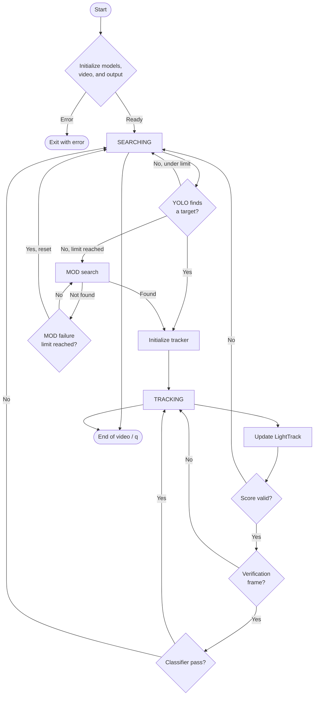

# YOLO_LT Application State Workflow

ဤစာတမ်းသည် project ၏ `inference_cpp` နှင့် `inference_py` အပိုင်းများတွင် လက်ရှိရေးသားထားသော code ကို အခြေခံ၍ application state workflow ကိုရှင်းပြထားခြင်းဖြစ်သည်။ နှစ်ဖက်လုံး၏ အဓိကရည်ရွယ်ချက်မှာ video frame တစ်ခုချင်းစီတွင် drone ကို ရှာဖွေပြီး၊ တွေ့ရှိပါက LightTrack ဖြင့် ဆက်လက်ခြေရာခံရန် ဖြစ်သည်။

## 1. System အကျဉ်းချုပ်

Application သည် အောက်ပါ module သုံးခုကို ပေါင်းစပ်အသုံးပြုသည်။

1. **YOLO visual detector** - frame တစ်ခုလုံးအတွင်း drone ကို object detection ဖြင့်ရှာသည်။
2. **MOD motion detector** - ယခင် frame နှင့် လက်ရှိ frame ကြား ရွေ့လျားနေသော object ကို ရှာပြီး classifier ဖြင့် drone ဟုတ်မဟုတ် စစ်သည်။
3. **LightTrack tracker** - ရှာဖွေတွေ့ရှိပြီးသော target ၏ local search area ကို frame တစ်ခုချင်းစီတွင် update လုပ်သည်။

Tracking အတွင်း target မဟုတ်နိုင်တော့သည်ဟု သတ်မှတ်ရန် **Net classifier** ကို သတ်မှတ်ထားသော frame interval ဖြင့် ထပ်မံစစ်ဆေးသည်။ အဓိက application state နှစ်ခုမှာ `SEARCHING` နှင့် `TRACKING` ဖြစ်ပြီး classifier verification နှင့် tracking score တို့က state ပြောင်းခြင်းကို ထိန်းချုပ်သည်။

## 2. Shared State Machine



Diagram ထဲရှိ label များကို တိုတောင်းစွာထားပြီး threshold အသေးစိတ်ကို အောက်တွင် သီးခြားဖော်ပြထားသည်။ ထို့ကြောင့် renderer အလိုက် node နှင့် transition စာသားများ ထပ်နေမှုလျော့နည်းစေသည်။

### State variable များ

| Variable | အဓိပ္ပါယ် |
|---|---|
| `tracking_state` | `false` ဖြစ်လျှင် search mode၊ `true` ဖြစ်လျှင် tracking mode |
| `frame_count` | စတင် processing လုပ်သော frame အရေအတွက် |
| `visual_fail_count` | YOLO သည် ဆက်တိုက် target မတွေ့သော frame အရေအတွက် |
| `mod_fail_count` | MOD သည် ဆက်တိုက် target မတွေ့သော frame အရေအတွက် |
| `prevFrame` / `prev_frame` | motion detection အတွက် ယခင် processed frame |
| `track_score` / `score` | LightTrack ၏ target confidence score |

သတ်မှတ်ချက်များမှာ C++ နှင့် Python နှစ်ဖက်လုံးတွင် အဓိကအားဖြင့် တူညီသည်။

- YOLO confidence threshold = `0.5`
- YOLO NMS threshold = `0.4` (C++ နှင့် detector implementation တွင် တိတိကျကျရှိသည်)
- YOLO failure threshold = `30` frames
- MOD failure threshold = `10` frames
- classifier verification interval = `30` frames
- classifier drone confidence threshold = `0.6`
- tracker score threshold = `0.98`

## 3. Common Application Lifecycle

### 3.1 Initialization state

Application စတင်ချိန်တွင် အောက်ပါအဆင့်များကို လုပ်ဆောင်သည်။

1. Configuration flags ကိုဖတ်သည်။
   - `VISUAL_DETECT`
   - `MOTION_DETECT`
   - `TRACKING`
2. Detector၊ tracker နှင့် classifier model များကို load လုပ်သည်။
3. Video input ကိုဖွင့်သည်။
4. ပထမ frame ကို `prevFrame` အဖြစ် သိမ်းထားသည်။
5. Output video writer နှင့် display window ကို ဖန်တီးသည်။
6. `tracking_state = false` ဖြင့် search mode မှ စတင်သည်။

Initialization အတွင်း model load မရခြင်း၊ video မဖွင့်နိုင်ခြင်း၊ ပထမ frame မဖတ်နိုင်ခြင်း သို့မဟုတ် output file မဖန်တီးနိုင်ခြင်း ဖြစ်ပါက main loop မဝင်ဘဲ error ဖြင့် ရပ်သည်။

### 3.2 Per-frame common pipeline

Frame တစ်ခုစီအတွက် အောက်ပါ common pipeline ရှိသည်။

1. Video မှ current frame ကိုဖတ်သည်။
2. Empty frame ဖြစ်လျှင် loop ရပ်သည်။
3. Frame counter တိုးပြီး display copy တစ်ခု ဖန်တီးသည်။
4. `tracking_state` အပေါ်မူတည်၍ search branch သို့မဟုတ် tracking branch ကို run သည်။
5. FPS နှင့် current mode ကို frame ပေါ်တွင်ရေးသည်။
6. Annotated frame ကို display လုပ်ပြီး output video ထဲသို့ရေးသည်။
7. Current frame ကို `prevFrame` အဖြစ် update လုပ်သည်။
8. User က `q` နှိပ်လျှင် loop ရပ်သည်။

## 4. SEARCHING State

`tracking_state == false` ဖြစ်လျှင် application သည် target ကို global frame အတွင်း ပြန်ရှာသည်။ Search strategy ကို YOLO ကို ဦးစားပေးပြီး၊ YOLO ဆက်တိုက်မတွေ့ပါက MOD သို့ ပြောင်းသည့်ပုံစံဖြင့်ရေးထားသည်။

### 4.1 Visual search: YOLO

အောက်ပါအခြေအနေတွင် YOLO ကိုအသုံးပြုသည်။

- visual detection enabled ဖြစ်ရမည်။
- YOLO detector object ရှိရမည် (Python တွင် model file ရှိမှ object ဖန်တီးသည်)။
- `visual_fail_count < 30` ဖြစ်ရမည်။
- MOD ပိတ်ထားပါက visual detector ကို force သုံးသည်။

YOLO pipeline သည် အောက်ပါအတိုင်းဖြစ်သည်။

1. Original frame ကို 640 x 640 letterbox ပြောင်းသည်။
2. BGR မှ RGB သို့ပြောင်းပြီး `[0, 1]` သို့ normalize လုပ်သည်။
3. HWC မှ CHW tensor ပြောင်းပြီး model inference လုပ်သည်။
4. Objectness နှင့် class score ကိုမြှောက်၍ final confidence တွက်သည်။
5. Confidence threshold အောက် detection များကိုဖယ်သည်။
6. Class တူ overlapping box များကို NMS ဖြင့်ဖယ်သည်။
7. ကျန် detection များအနက် confidence အမြင့်ဆုံး box ကို target candidate အဖြစ်ရွေးသည်။

Detection ရပါက `visual_fail_count = 0` နှင့် `mod_fail_count = 0` ပြန်ထားသည်။ Detection မရပါက `visual_fail_count` တိုးသည်။ `visual_fail_count` သည် 30 မရောက်သေးသရွေ့ နောက် frame တွင် YOLO ကို ဆက်သုံးသည်။

### 4.2 Motion search: MOD

YOLO မသုံးနိုင်တော့သည့်အချိန်၊ သို့မဟုတ် YOLO ပိတ်ထားသည့်အချိန်တွင် MOD ကိုသုံးသည်။ MOD သည် neural detector တစ်ခုတည်းမဟုတ်ဘဲ classical computer vision နှင့် classifier ပေါင်းစပ်ထားသော pipeline ဖြစ်သည်။

MOD pipeline သည် အောက်ပါအတိုင်းဖြစ်သည်။

1. `prevFrame` နှင့် current frame ကို Gaussian blur လုပ်ပြီး grayscale ပြောင်းသည်။
2. Global optical flow ဖြင့် camera/background motion ကိုခန့်မှန်းသည်။
3. Homography ဖြင့် ယခင် frame ကို current frame နှင့် compensate လုပ်သည်။
4. Compensated frame နှင့် current frame ကို absolute difference လုပ်သည်။
5. Mean difference အပေါ်မူတည်သော adaptive threshold သုံးသည်။
6. Edge mask၊ median blur၊ morphology opening/closing ဖြင့် noise လျှော့သည်။
7. Contour များမှ candidate box များဖန်တီးသည်။
8. Area နှင့် aspect ratio ဖြင့် filter လုပ်သည်။
9. Candidate တစ်ခုချင်းစီတွင် local Shi-Tomasi feature နှင့် Lucas-Kanade optical flow စစ်သည်။
10. Motion distance/angle variance များလွန်းလျှင် candidate ကိုဖယ်သည်။
11. Candidate crop ကို 32 x 32 classifier သို့ပေးပြီး drone class ဖြစ်မှ box ကို return လုပ်သည်။

MOD box ရပါက `mod_fail_count = 0` ဖြစ်ပြီး candidate ကို tracker initialization အတွက်သုံးသည်။ Box မရပါက `mod_fail_count` တိုးသည်။ `mod_fail_count >= 10` ဖြစ်လျှင် visual counter နှင့် MOD counter နှစ်ခုလုံးကို reset လုပ်ပြီး နောက် search cycle ကို YOLO ဦးစားပေးနိုင်အောင် ပြန်စသည်။

### 4.3 Search မှ Tracking သို့ပြောင်းခြင်း

Candidate `bbox` ရရှိပြီး `TRACKING` enabled ဖြစ်လျှင် tracker ကို initialize လုပ်သည်။

- C++ တွင် `[x, y, w, h]` ကို `(x0, y0, x1, y1)` သို့ပြောင်းပြီး frame boundary ကိုစစ်သည်။
- Python တွင် bbox ၏ ပထမ 4 တန်ဖိုးကို integer အဖြစ်သန့်စင်ပြီး `tracker.init()` သို့ပေးသည်။
- Tracker initialization အောင်မြင်ပါက `tracking_state = true` ဖြစ်သည်။
- Search failure counters နှစ်ခုလုံးကို zero ပြန်ထားသည်။

Candidate မရလျှင် frame ပေါ်တွင် `SEARCHING (VISUAL ...)` သို့မဟုတ် `SEARCHING (MOTION ...)` status ကိုရေးပြီး search mode ထဲတွင် ဆက်ရှိသည်။

`TRACKING` configuration ပိတ်ထားပါက candidate ရသော်လည်း tracker initialize မလုပ်ဘဲ search mode ထဲတွင် ဆက်နေသည်။ Python code တွင် `not tracking_state or not ENABLE_CONFIG["TRACKING"]` ကြောင့် tracking disabled အခြေအနေသည် frame တိုင်း global search ပြန်လုပ်သည့် behavior ဖြစ်သည်။

## 5. TRACKING State

`tracking_state == true` ဖြစ်လျှင် YOLO/MOD ကို frame တိုင်းမခေါ်ဘဲ LightTrack ကိုသုံးသည်။ Tracker သည် initialization frame မှ target appearance feature `zf` ကိုသိမ်းထားပြီး နောက် frame များတွင် update model ဖြင့် target position/size ကိုခန့်မှန်းသည်။

### 5.1 LightTrack update pipeline

1. ယခင် target center နှင့် target size မှ context ပါသော search size တွက်သည်။
2. Frame ထဲမှ search crop ကိုထုတ်ပြီး 288 x 288 သို့ resize လုပ်သည်။
3. BGR -> RGB၊ normalize နှင့် tensor conversion လုပ်သည်။
4. LightTrack update model သို့ exemplar feature နှင့် search tensor ပေးသည်။
5. Classification map ကို sigmoid ဖြင့် confidence map ပြောင်းသည်။
6. Bounding box regression ကို decode သည်။
7. Scale penalty၊ aspect-ratio penalty နှင့် Hanning window influence သုံး၍ အကောင်းဆုံးနေရာရွေးသည်။
8. Target center နှင့် size ကို update လုပ်သည်။
9. Frame boundary အတွင်း target position/size ကို clamp လုပ်သည်။

Tracker score သည် target classification map ထဲမှ အမြင့်ဆုံး score ဖြစ်သည်။ C++ တွင် `track_score` အဖြစ်ရပြီး Python တွင် `tracker.track()` မှ `(bbox, score)` အဖြစ်ပြန်ရသည်။

### 5.2 Periodic classifier verification

Frame count 30 ၏ multiple ဖြစ်တိုင်း current tracker bbox ကို context ဖြင့်ချဲ့ပြီး ROI ဖြတ်သည်။ ROI သည် အလွန်သေးလျှင် verification မလုပ်ဘဲ ဆက်သွားသည်။ Valid ROI ဖြစ်လျှင် Net classifier သို့ပေးသည်။

- Class `1` နှင့် drone confidence `>= 0.6` ဖြစ်လျှင် tracking ဆက်လုပ်သည်။
- Class မမှန်ခြင်း သို့မဟုတ် confidence နိမ့်ခြင်း ဖြစ်လျှင် `tracking_state = false` လုပ်ပြီး search mode သို့ပြန်သည်။

C++ တွင် ROI expansion factor သည် `3.0` ဖြစ်ပြီး Python တွင်လည်း main workflow ခေါ်ဆိုရာတွင် `3` သုံးထားသည်။

### 5.3 Tracking ပျောက်ဆုံးခြင်း

Classifier verification မအောင်မြင်ပါက သို့မဟုတ် LightTrack score `<= 0.98` ဖြစ်ပါက tracking ကိုရပ်သည်။ ပြီးလျှင်

- `tracking_state = false`
- `visual_fail_count = 0`
- `mod_fail_count = 0`

ဟု reset လုပ်ပြီး နောက် frame မှစ၍ SEARCHING branch ထဲသို့ပြန်ဝင်သည်။ Tracking အောင်မြင်နေသရွေ့ bbox၊ score နှင့် search area ကို display/output frame ပေါ်တွင်ရေးသည်။

## 6. C++ Workflow (`inference_cpp`)

### Entry point

Entry point သည် `inference_cpp/main.cpp` ထဲရှိ `main()` ဖြစ်သည်။ Command line ပုံစံမှာ

```text
./Light_DT <model.onnx> <video_path>
```

`argc < 3` ဖြစ်လျှင် usage ပြပြီး `-1` ဖြင့်ရပ်သည်။ YOLO model path ကို command line မှရပြီး LightTrack နှင့် classifier model path များကို executable ၏ parent project `model/` directory မှတည်ဆောက်သည်။

### Model/backend lifecycle

- YOLO: ONNX Runtime session; CUDA provider ရနိုင်လျှင် CUDA၊ မရလျှင် CPU fallback။
- LightTrack: `lighttrack_init.onnx` နှင့် `lighttrack_update.onnx` ကို ONNX Runtime session နှစ်ခုဖြင့် load သည်။
- MOD/classifier: `Net_best.onnx` ကို ONNX Runtime ဖြင့် load သည်။
- CMake သည် C++17၊ OpenCV နှင့် system-installed ONNX Runtime ကို link လုပ်သည်။

### C++ အထူး behavior

- YOLO သည် detection များထဲမှ confidence အမြင့်ဆုံး box ကိုရွေးသော်လည်း class id ကို သီးခြားစစ်ဆေးထားခြင်း မတွေ့ရပါ။ Model output နှင့် class mapping ကို မူတည်နေသည်။
- Tracking အတွင်း tracker target center သည် frame အပြင်ဘက်သို့ ရောက်နေပါက tracker update မခေါ်ဘဲ `tracking_state = false` လုပ်ပြီး ထို iteration ကို `continue` လုပ်သည်။ ထို့ကြောင့် ထို frame တွင် display/output write မဖြစ်နိုင်ပါ။
- Output ကို project root ၏ `output_video.mp4` သို့ အမြဲရေးသည်။
- Display window အမည်သည် `demo` ဖြစ်ပြီး `q` key ဖြင့်ထွက်သည်။
- Video FPS မရလျှင် 60 ဟု fallback သတ်မှတ်သည်။

## 7. Python Workflow (`inference_py`)

### Entry point

Integrated application entry point သည် `inference_py/main.py` ၏ `main()` ဖြစ်ပြီး အခြေခံအားဖြင့်

```text
cd inference_py
python main.py
```

ဖြင့် run ရသည်။ Input video၊ device၊ model path နှင့် backend ရွေးချယ်မှုများသည် `main.py` ထဲတွင် hard-coded configuration အဖြစ်ရှိသည်။

### Model/backend lifecycle

- `USE_TENSORRT_10 = True` ဖြစ်လျှင် `modules_trt10.YOLO_Engine_TRT10.YOLO_Detector` ကို import သည်။ False ဖြစ်လျှင် TensorRT 8.6 `YOLO_Engine` ကို import သည်။
- LightTrack သည် TorchScript `.pt` init/update model နှစ်ခုကို `LightTrackEngine` မှ load သည်။
- Tracker နှင့် YOLO နှစ်ခုလုံးအတွက် dummy frame ဖြင့် warm-up တစ်ကြိမ်လုပ်သည်။
- Net classifier သည် `Net_best.pth` ကို PyTorch `Net` architecture ဖြင့် load ပြီး `eval()` mode သို့ပြောင်းသည်။
- Device သည် configuration အရ `cuda` ဖြစ်သည်။ CUDA မရှိလျှင် main workflow သည် အလိုအလျောက် CPU fallback မလုပ်ထားပါ။

### Python output lifecycle

Output directory သည် project root ကိုညွှန်ရန် ရည်ရွယ်ထားသော `../assets` ဖြစ်ပြီး timestamp ပါသော `result_YYYYMMDD_HHMMSS.mp4` ဖိုင်တစ်ခုဖန်တီးသည်။ Display window အမည်သည် `System Demo` ဖြစ်သည်။

### Python အထူး behavior

- YOLO detector သည် model file ရှိမှသာ initialize ဖြစ်သည်။ YOLO ပိတ်ထားလျှင် detector object မဖန်တီးဘဲ MOD branch သို့သွားနိုင်သည်။
- MOD သည် `MOD2_global(prev_frame, curr_frame)` မှ tuple/list/NumPy array return format များကို လက်ခံရန် compatibility parsing လုပ်ထားသည်။
- Python LightTrack engine ၏ tracker position-jump protection (`_check_pos_change`) code သည် လက်ရှိ `track()` ထဲတွင် comment out ဖြစ်နေသည်။ ထို့ကြောင့် abnormal jump ကို score zero အဖြစ် force မလုပ်ပါ။
- Display တွင် search area ကို အဖြူရောင် box ဖြင့်လည်း ပြသသည်။
- FPS display သည် `current_fps * 2` ကိုရေးထားသောကြောင့် UI တွင်ပြသော FPS သည် measured FPS နှင့် မတူနိုင်သည်။
- Input video ဖတ်မရလျှင်၊ model မရှိလျှင် သို့မဟုတ် tracker load exception ဖြစ်လျှင် အများအားဖြင့် `return` သို့ `sys.exit(1)` ဖြင့်ရပ်သည်။

## 8. Standalone Python Classifier Workflow (`infer_net.py`)

`infer_net.py` သည် integrated detector-tracker application မဟုတ်ဘဲ `Net_best.pth` binary classifier ကို သီးခြားစမ်းရန် command-line utility ဖြစ်သည်။

1. `input` argument ကို image၊ folder သို့မဟုတ် video အဖြစ် ခွဲခြားသည်။
2. `Net` model ကို weights ဖြင့် load ပြီး `eval()` လုပ်သည်။
3. Input image တစ်ခုစီကို 32 x 32 resize၊ tensor conversion လုပ်သည်။
4. Model output ကို softmax လုပ်ပြီး `background` သို့မဟုတ် `drone` class ရွေးသည်။
5. Folder ဖြစ်လျှင် file တစ်ခုစီကို infer လုပ်ပြီး class statistics စုသည်။
6. Video ဖြစ်လျှင် frame တစ်ခုစီတွင် label ရေး၊ window ပြပြီး `q` ဖြင့်ရပ်သည်။

ဤ utility ၏ state machine သည် `LOAD_MODEL -> INFER_INPUT -> DISPLAY/REPORT -> END` ဖြစ်ပြီး YOLO၊ MOD နှင့် LightTrack state transitions မပါဝင်ပါ။

## 9. C++ နှင့် Python တူညီချက် / ကွာခြားချက်

### တူညီသော logic

- Search mode နှင့် tracking mode နှစ်ခုရှိသည်။
- Search တွင် YOLO ကို ဦးစားပေးပြီး repeated failure နောက် MOD သို့ fallback လုပ်သည်။
- MOD failure 10 ကြိမ်နောက် counters reset လုပ်သည်။
- Detection box ရလျှင် LightTrack initialize လုပ်သည်။
- Tracking score threshold `0.98` နှင့် periodic classifier verification သုံးသည်။
- Tracking ပျောက်လျှင် counters reset လုပ်ပြီး global search သို့ပြန်သည်။
- Frame တစ်ခုစီကို annotate၊ display နှင့် output video write လုပ်သည်။

### မတူညီသော implementation

| အပိုင်း | C++ | Python |
|---|---|---|
| Runtime | ONNX Runtime | TensorRT YOLO + PyTorch/TorchScript tracker/classifier |
| YOLO input | CLI model path | `main.py` configuration path |
| LightTrack weights | `.onnx` | TorchScript `.pt` |
| Classifier weights | `Net_best.onnx` | `Net_best.pth` |
| Tracker crop | OpenCV/CPU memory path | GPU tensor crop and resize |
| Initialization | no explicit warm-up | tracker နှင့် YOLO warm-up ရှိ |
| Video output | fixed `output_video.mp4` | timestamped file in `../assets` |
| Tracker jump guard | helper method ရှိသော်လည်း main loop တွင်မခေါ် | helper logic comment out |
| FPS UI | smoothed FPS ကိုတိုက်ရိုက်ပြ | measured FPS ကို `* 2` ပြ |
| CPU fallback | ONNX Runtime CUDA မရလျှင် CPU fallback | configured `cuda` မရလျှင် startup/runtime ပြဿနာဖြစ်နိုင် |

## 10. Error, Exit နှင့် Resource States

### Error states

- Model file မရှိခြင်း သို့မဟုတ် model format မကိုက်ခြင်း
- ONNX Runtime/TensorRT provider သို့မဟုတ် plugin မရခြင်း
- Video input မဖွင့်နိုင်ခြင်း
- First frame မဖတ်နိုင်ခြင်း
- Output writer မဖွင့်နိုင်ခြင်း
- Empty/invalid ROI သို့မဟုတ် out-of-frame bbox

C++ တွင် အစောပိုင်း error များအတွက် error message ရေးပြီး negative return code သုံးသည်။ Python တွင် တချို့ initialization error များသည် `return` ဖြင့်သာ ထွက်ပြီး LightTrack load exception သည် `sys.exit(1)` ဖြင့်ထွက်သည်။

### Normal exit

- Video frame မကျန်တော့ခြင်း
- User က `q` နှိပ်ခြင်း
- Python/C++ main loop ပြီးဆုံးခြင်း

Normal exit တွင် video capture၊ video writer နှင့် OpenCV window များကို release/destroy လုပ်သည်။ C++ တွင် `cap.release()` နှင့် `outputVideo.release()` ကို explicitly ခေါ်သည်။ Python တွင် `cap.release()` နှင့် `cv2.destroyAllWindows()` ကိုခေါ်သည်။

## 11. လက်တွေ့စစ်ဆေးသင့်သောအချက်များ

အောက်ပါအချက်များသည် workflow document ရေးရာတွင် code ထဲက လက်ရှိ behavior အဖြစ်မှတ်တမ်းတင်ထားခြင်းဖြစ်ပြီး production deployment မတိုင်မီ စစ်ဆေးသင့်သည်။

1. Python `VIDEO_PATH` သည် local absolute path ဖြစ်သောကြောင့် အခြားစက်တွင် တိုက်ရိုက်အလုပ်မလုပ်နိုင်ပါ။
2. Python YOLO TensorRT path များတွင် `.pt` ဟုသတ်မှတ်ထားသော်လည်း အမှန်တကယ် loader လိုအပ်သော engine/model format နှင့် ကိုက်ညီမှု စစ်ရန်လိုသည်။
3. Python main သည် `cuda` ကို default သုံးသောကြောင့် CUDA မရှိသော environment အတွက် explicit CPU fallback ထည့်ရန်လိုနိုင်သည်။
4. C++ မှာ CLI YOLO model path သာ argument ဖြင့်ရပြီး LightTrack/classifier model path များကို project layout ပေါ်တွင် အားထားနေသည်။
5. Detection candidate များထဲမှ target class filtering မရှိသည့် C++ YOLO selection သည် multi-class model ဖြစ်ပါက မှားယွင်းသော class ကိုရွေးနိုင်သည်။
6. Search fallback သည် “YOLO 30 frames မတွေ့မှ MOD” ဟူသော policy ဖြစ်ပြီး frame တစ်ခုစီတွင် YOLO နှင့် MOD နှစ်ခုလုံးကို တပြိုင်နက် မစစ်ပါ။
7. Classifier verification သည် 30-frame interval တွင်သာလုပ်သောကြောင့် verification ကြားကာလတွင် tracker drift ဖြစ်နိုင်သည်။
8. `TRACKING` ပိတ်ထားသော configuration သည် detection-only output မဟုတ်ဘဲ frame တိုင်း search ပြန်လုပ်သည့် workflow ဖြစ်သည်။

## 12. အနှစ်ချုပ်

`inference_cpp` နှင့် `inference_py` သည် architecture အဆင့်တွင် workflow တူညီသည်။ နှစ်ဖက်စလုံးသည် `INITIALIZING -> SEARCHING -> TRACKING -> SEARCHING` state cycle ကိုအသုံးပြုပြီး YOLO၊ MOD၊ LightTrack နှင့် classifier verification တို့ကို အဆင့်လိုက်ပေါင်းစပ်ထားသည်။ အဓိကကွာခြားချက်မှာ C++ implementation သည် ONNX Runtime အခြေပြုဖြစ်ပြီး Python implementation သည် TensorRT/PyTorch/TorchScript အခြေပြုဖြစ်ခြင်း၊ model path/configuration နှင့် error/resource handling အသေးစိတ်များ ကွာခြားခြင်းဖြစ်သည်။
