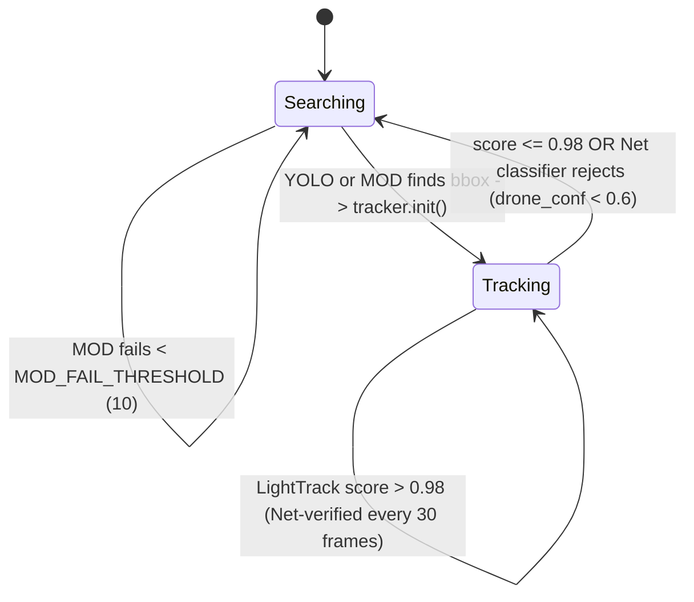

# YOLO_LT — Project Investigation

Reference notes for building a tiny/lightweight drone detector-tracker.

## Overview
Small-target (drone/UAV) detection + tracking system with two parallel
implementations: [inference_py/](inference_py) (PyTorch/TensorRT, full research
stack incl. ablation studies) and [inference_cpp/](inference_cpp) (ONNX
Runtime, deployable C++17 app). Same finite-state-machine logic is duplicated
in both ([main.py](inference_py/main.py) vs [main.cpp](inference_cpp/main.cpp)).

## Architecture: 3-module state machine
The system is a **cascade of cheap → expensive modules**, switching based on
consecutive failure counters rather than running everything every frame:

1. **Search stage** — YOLOv5 detector runs first. After `VISUAL_FAIL_THRESHOLD`
   (30) consecutive misses, falls back to `MOD2_global` (motion detection via
   optical-flow-based ego-motion compensation, see below). If MOD also fails
   `MOD_FAIL_THRESHOLD` (10) times in a row, the fail counters reset and it
   retries YOLO. This avoids running the heavier YOLO detector every frame
   once a cheaper signal (motion) is available, and avoids getting stuck if
   the target isn't actually moving.
2. **Track stage** — LightTrack (single-object tracker, split into
   `init`/`update` ONNX graphs) tracks the bbox every frame. Every
   `NET_VERIFY_INTERVAL` (30) frames, crops a 3x-expanded ROI around the
   current box and runs it through a tiny CNN classifier (`Net`, LeNet-like:
   conv(3→6,5)-conv(6→16,5)-fc(400→120)-fc(120→84)-fc(84→2)) to re-verify the
   tracked patch is still "drone" (class 1) vs background, with confidence
   >= 0.6. This guards against LightTrack silently drifting onto background
   clutter. Track is dropped if `score <= 0.98` (LightTrack's own confidence)
   or classifier rejects it.
3. Both Python and C++ implement this identically (`ENABLE_CONFIG` /
   `EnableConfig` struct lets each module be toggled independently for
   ablation).

## Key components
- **YOLO detector**: YOLOv5-based, multiple custom architecture variants in
  [inference_py/yolov5/models/](inference_py/yolov5/models) aimed at tiny
  targets:
  - `yolov5s_add_p2*.yaml` — adds a P2 (stride-4) detection head for very
    small objects.
  - `*_gsconv*.yaml` — GSConv + VoVGSCSP "slim-neck" (fewer params than
    standard C3 neck).
  - `*_gsconv_ls.yaml` — adds `LSKBlock` (Large Selective Kernel attention),
    placed before SPPF and at the P2 branch specifically to boost small-object
    receptive field.
  - `yolov5_lsnet*.yaml` + [ska.py](inference_py/yolov5/models/ska.py) — LSKNet
    variant with a custom Triton kernel (`ska_fwd`/`ska_bwd_x`) for selective
    kernel attention (GPU-only, needs `triton`).
  - Deployed weights: `GDUT_UAV.onnx`/`.pt` (28MB) and `yolov5s_GLAD*` engines
    trained per-dataset. Two runtime backends: TensorRT 8.6 (`.engine`) and
    TensorRT 10 (`.pt` via `modules_trt10/`), selected by `USE_TENSORRT_10`
    flag in [main.py](inference_py/main.py).
- **LightTrack**: NAS-based lightweight tracker (CVPR'21,
  "LightTrack: Finding Lightweight Neural Networks for Object Tracking via
  One-Shot Architecture Search"). Split into two small ONNX graphs —
  `init` (4.8MB) and `update` (7.6MB) — exemplar (127px) vs instance/search
  (288px) image sizes, `context_amount=0.5`. Implementation in
  [inference_py/lib/tracker/lighttrack.py](inference_py/lib/tracker/lighttrack.py)
  and C++ port in [inference_cpp/include/light_track.h](inference_cpp/include/light_track.h)/[src/light_track.cpp](inference_cpp/src/light_track.cpp).
- **MOD (Motion Detection)**: [inference_py/MOD2.py](inference_py/MOD2.py) /
  [inference_cpp/src/motion_detector.cpp](inference_cpp/src/motion_detector.cpp).
  Classic CV pipeline, no NN: grid-based KLT optical flow
  (`cv2.calcOpticalFlowPyrLK`) between consecutive frames + RANSAC homography
  to estimate/compensate camera ego-motion (`motion_compensate` /
  `motion_compensate_local` in [Functions.py](inference_py/Functions.py)),
  then diffs the compensated frames to find moving blobs. Useful for
  detecting drones YOLO misses (e.g. heavily downsampled/blurred) as long as
  the camera platform itself is roughly planar-trackable.
- **Net classifier**: tiny LeNet-style CNN, 32x32 input, binary
  drone-vs-background, used only as a periodic sanity check on the tracker —
  not a per-frame cost.

## Performance data points (from ablation CSVs)
- [ablation_ARD_results.csv](inference_py/ablation_ARD_results.csv) (ARD-MAV
  dataset) and [ablation_GDUT_results.csv](inference_py/ablation_GDUT_results.csv)
  (GDUT-HWD dataset) sweep configs: `Full`, `w/o MOD`, `w/o YOLO`, `w/o LT`,
  `Only YOLO`, `Only MOD`, `YOLO+LT`.
- **MOD matters a lot for recall on hard sequences**: e.g. GDUT `gdut_mav_05`
  recall drops from 0.739 (Full) to 0.325 (w/o MOD) — MOD recovers targets
  YOLO+LightTrack alone lose. Same pattern in ARD (`phantom05`/`phantom08`/etc.
  go to 0 recall without MOD).
  - Removing MOD/motion path can also reduce FPS dramatically (e.g. w/o MOD
    logging shows FPS in the thousands on easy frames because tracking loop
    exits fast, but real accuracy tanks) — **note the reported FPS numbers
    look unrealistic on failed sequences** — likely just measuring
    empty/early-exit loop iterations, not indicative of true throughput. Don't
    take raw FPS column at face value without checking recall alongside it.
- **YOLO is the main precision driver**: `w/o YOLO` collapses precision/recall
  broadly (e.g. gdut_mav_01: 0.88 F1 -> 0.22 F1).
- Full pipeline (cascaded 3-module FSM) generally matches or beats any single
  module alone — validates the cascade design over running one model only.

## Reusable ideas for a tiny drone detector project
1. **Cascade cheap→expensive perception**: don't run a full detector on every
   frame once you have a lock; use fail-counters (not just per-frame scores)
   to decide when to escalate back to detection. Two independent thresholds
   (visual vs motion) avoid oscillation.
2. **Classical motion detection as a free fallback** for tiny/low-contrast
   targets that CNN detectors miss — grid KLT + RANSAC homography for
   ego-motion compensation is lightweight (CPU-only, no GPU needed) and pairs
   well with a GPU detector.
3. **Periodic lightweight re-verification of the tracker**, not just trusting
   the tracker's own confidence score — a tiny separate classifier (LeNet-
   scale, 32x32 input) catches drift onto background clutter at near-zero
   extra cost (every 30 frames only).
4. **Architecture tricks for tiny-object YOLO**: add a P2/stride-4 head,
   GSConv/VoVGSCSP slim-neck to cut params, and attention (LSK) placed
   specifically at the small-object branch rather than uniformly.
5. **Split tracker into init/update graphs** for ONNX/TensorRT export — makes
   the one-time template extraction separate from the per-frame update,
   simplifying deployment/caching.
6. Both a Python (training/experimentation, TensorRT) and C++ (ONNX Runtime,
   deployment) implementation are kept in sync structurally — worth doing if
   the project needs both a research and an edge-deployment path.

## Datasets referenced
- **ARD-MAV** (phantom* sequences) and **GDUT-HWD** (gdut_mav* sequences) —
  used for ablation only; no dataset download code found in this repo (assumed
  external/local paths).

## Limitation: single-target only (no multi-drone support)
Confirmed by code, not just design docs — this is a hard architectural limit,
not a config toggle:
- [YOLO_Engine.py](inference_py/YOLO_Engine.py) `post_process()` keeps only the
  highest-score box (`best_idx = argmax(scores)`), discarding every other
  detection even if several drones are visible in frame.
- [MOD2.py](inference_py/MOD2.py) `MOD2_global()` finds multiple motion-contour
  candidates internally but `break`s on the first one that passes the
  `Mynet_infer` classifier, returning one `rect_final` tuple.
- Only one `LightTrackEngine`/`LightTrack` instance and one `tracking_state`
  bool exist in [main.py](inference_py/main.py)/[main.cpp](inference_cpp/main.cpp) —
  no track list, IDs, or data association.

To support multiple simultaneous drones this project would need:
1. Return all filtered detections from YOLO/MOD instead of top-1 only.
2. A track manager holding a list of tracker instances (one per target) with
   IDs and per-track state (search/track, fail counters).
3. Data association (IoU or Hungarian matching) between new detections and
   existing tracks to avoid spawning duplicate trackers for the same drone.
4. Track birth/death lifecycle instead of the single `tracking_state` flag.
5. Dedup between YOLO and MOD candidate boxes so both paths don't create
   separate tracks for the same physical target.

## Caveats / things not yet verified
- Model accuracy numbers are for specific test sequences, not a full
  benchmark — treat as indicative, not authoritative.
- `ska.py` requires `triton` and CUDA; won't run on CPU-only or non-NVIDIA
  setups.
- Hardcoded absolute paths in [main.py](inference_py/main.py) (e.g.
  `/home/verser/Videos/fast_drone.mp4`) — dev-machine specific, needs editing
  before running.
