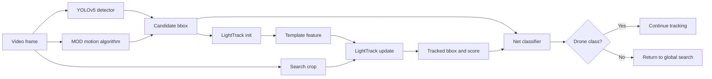

# YOLO_LT Model Architectures and Inference Algorithms

ဤစာတမ်းသည် `inference_cpp` နှင့် `inference_py` တွင် လက်ရှိအသုံးပြုထားသော model များ၊ model wrapper များ၊ preprocessing/postprocessing ပုံစံများနှင့် model အချင်းချင်း ပေါင်းစပ်အသုံးပြုသည့် algorithm workflow ကို source code အခြေခံ၍ ရှင်းပြထားခြင်းဖြစ်သည်။

အဓိက model family များမှာ

1. **YOLOv5 detector** - frame တစ်ခုလုံးတွင် drone candidate ရှာရန်
2. **LightTrack** - detected target ကို frame တစ်ခုချင်းစီတွင် track လုပ်ရန်
3. **Net binary classifier** - candidate သို့မဟုတ် tracked ROI သည် drone ဟုတ်မဟုတ် စစ်ရန်
4. **MOD algorithm** - frame difference နှင့် optical flow ဖြင့် ရွေ့လျားနေသော candidate ရှာရန်

## 1. Model အသုံးပြုမှုမြင်ကွင်း



YOLO သို့မဟုတ် MOD က initial bbox ရှာပေးပြီးမှသာ LightTrack ကို initialize လုပ်သည်။ LightTrack သည် နောက် frame များတွင် bbox update လုပ်ပေးသည်။ Net classifier သည် MOD candidate ကိုလည်း စစ်နိုင်ပြီး tracking အတွင်း periodic verification အဖြစ်လည်း အသုံးပြုသည်။

## 2. Model နှင့် File Mapping

| Model/Algorithm | Python artifact | C++ artifact | အဓိကတာဝန် |
|---|---|---|---|
| YOLOv5 detector | `yolov5s_GLAD.pt`, TensorRT 8 engine သို့မဟုတ် `GDUT_UAV.pt` | command line မှပေးသော YOLO `.onnx` | Global object detection |
| LightTrack init/template | `lighttrack_init.pt` | `lighttrack_init.onnx` | Initial target appearance feature ထုတ်ခြင်း |
| LightTrack update/search | `lighttrack_update.pt` | `lighttrack_update.onnx` | Search crop မှ position/size ခန့်မှန်းခြင်း |
| Drone classifier | `Net_best.pth` | `Net_best.onnx` | `background`/`drone` binary classification |
| MOD | `MOD2.py` + `Functions.py` | `motion_detector.cpp` | Camera motion ဖယ်ပြီး moving candidate ရှာခြင်း |

`inference_py/model/` ထဲတွင် TensorRT 8/10၊ PyTorch၊ ONNX နှင့် LightTrack engine artifact များ အားလုံးရှိသော်လည်း integrated `main.py` သည် configuration အရ artifact တစ်စုံကိုသာ runtime တွင်ရွေးသည်။

## 3. YOLOv5 Detector Architecture

### 3.1 Architecture အမျိုးအစား

Project ထဲက YOLO implementation သည် YOLOv5 codebase ကိုအခြေခံထားသည်။ `inference_py/yolov5/models/yolo.py` တွင် `Model` သည် YAML ၏ `backbone` နှင့် `head` ကို parse လုပ်ပြီး နောက်ဆုံးတွင် multi-scale `Detect` head ကိုတည်ဆောက်သည်။ `Detect` layer သည် feature map scale တစ်ခုစီတွင် 1 x 1 convolution ဖြင့် anchor တစ်ခုစီအတွက်

```text
[x, y, w, h, objectness, class scores]
```

ကိုထုတ်ပေးသည်။ Training မဟုတ်သောအချိန်တွင် sigmoid၊ grid decode နှင့် anchor decode ပြီး output ကို `[batch, detections, no]` ပုံစံပြောင်းသည်။

Project တွင် `yolov5s_GLAD` အတွက် မူရင်း YAML ဖိုင်ကို သီးခြားမတွေ့ရသဖြင့် `.pt`/TensorRT artifact ၏ exact channel/depth setting ကို source မှ အပြည့်အဝအတည်ပြု၍ မရပါ။ သို့သော် ရှိပြီးသား YOLOv5 YAML များနှင့် code အရ project သည် YOLOv5 small/custom small detector variants များကို အသုံးပြုရန် တည်ဆောက်ထားသည်။

### 3.2 Tiny-object variant: P2 head

`yolov5s_add_p2.yaml` တွင် standard YOLOv5 P3/P4/P5 output များအပြင် P2/4 output head ထပ်ထည့်ထားသည်။ P2 feature map သည် spatial resolution ပိုမြင့်သောကြောင့် drone ကဲ့သို့ pixel အနည်းငယ်သာရှိသော target များအတွက် localization အထောက်အကူပြုသည်။ အဆိုပါ YAML ၏ head သည် P2, P3, P4, P5 လေးခုသို့ Detect layer ထုတ်ပေးသည်။

### 3.3 YOLOv5 main pipeline

#### Preprocessing

1. Frame ကို aspect ratio မပျက်စေရန် letterbox လုပ်သည်။
2. Target input size သည် ပုံမှန်အားဖြင့် 640 x 640 ဖြစ်သည်။
3. BGR မှ RGB သို့ပြောင်းသည်။
4. HWC မှ CHW သို့ပြောင်းပြီး batch dimension ထည့်သည်။
5. Pixel value ကို 255 ဖြင့်စား၍ `[0, 1]` သို့ normalize လုပ်သည်။

#### Inference

- Python TensorRT implementation သည် host buffer မှ device buffer သို့ asynchronous copy လုပ်ပြီး TensorRT execution context ဖြင့် inference လုပ်သည်။
- Python PyTorch implementation သည် `attempt_load()` ဖြင့် model load ပြီး `model(img)[0]` ခေါ်သည်။
- C++ implementation သည် ONNX Runtime session သုံးပြီး CUDA provider ရနိုင်လျှင် CUDA၊ မရလျှင် CPU သုံးသည်။

#### Postprocessing

1. Confidence threshold အောက် output များကိုဖယ်သည်။
2. Letterbox padding/scale ကိုပြန်ဖယ်ပြီး original frame coordinate သို့ပြန် map လုပ်သည်။
3. Class တူ overlapping box များကို NMS ဖြင့်ဖယ်သည်။
4. ကျန် box များထဲမှ confidence အမြင့်ဆုံး box တစ်ခုကို integrated tracker အတွက် return လုပ်သည်။

C++ ONNX parser သည် output ကို `[1, 25200, 6]` ဟုမျှော်မှန်းထားပြီး row တစ်ခုကို `cx, cy, w, h, objectness, class score` အဖြစ်ဖတ်သည်။ Python TensorRT 8 wrapper သည် engine output ၏ ပထမတန်ဖိုးကို box count အဖြစ်ဖတ်ပြီး ကျန် output ကို 6-column prediction အဖြစ် reshape လုပ်သည်။ ထို့ကြောင့် model export output contract သည် wrapper နှင့်ကိုက်ညီရမည်။

### 3.4 YOLO runtime variants

#### Python TensorRT 10/PyTorch path

`main.py` တွင် `USE_TENSORRT_10 = True` ဖြစ်လျှင် `modules_trt10/YOLO_Engine_TRT10.py` ကို import လုပ်သည်။ အမည်တွင် TensorRT ဟုပါသော်လည်း လက်ရှိ file ၏ implementation သည် `attempt_load()` ဖြင့် PyTorch weight ကို load လုပ်ပြီး PyTorch inference လုပ်သည်။ `yolov5s_GLAD.pt` path ကို အသုံးပြုသည်။

#### Python TensorRT 8 path

`USE_TENSORRT_10 = False` ဖြစ်လျှင် `YOLO_Engine.py` ကိုသုံးသည်။ ဤ wrapper သည် TensorRT engine ကို deserialize လုပ်ပြီး explicit/implicit batch နှစ်မျိုးကို handle လုပ်သည်။ CUDA pinned host memory၊ device memory၊ asynchronous copy နှင့် NMS postprocessing ပါရှိသည်။

#### C++ ONNX path

`YoloDetector` သည် input 640 x 640၊ letterbox၊ RGB/CHW normalization၊ ONNX Runtime inference၊ confidence filtering နှင့် custom class-aware NMS ကိုလုပ်သည်။ C++ main သည် detection များထဲမှ confidence အမြင့်ဆုံး box ကိုရွေးသော်လည်း class id ကို သီးခြားစစ်မထားပါ။

## 4. LightTrack Architecture

### 4.1 Network type

LightTrack သည် one-shot architecture search မှ ရွေးချယ်ထားသော lightweight Siamese-style visual tracker ဖြစ်သည်။ Tracker တွင် input နှစ်မျိုးရှိသည်။

- **Template/exemplar image (`z`)** - target ကို initialize လုပ်ချိန်တွင် crop လုပ်ပြီး target appearance feature ထုတ်သည်။
- **Search image (`x`)** - နောက် frame တစ်ခုစီတွင် target အနီးတစ်ဝိုက်မှ crop လုပ်ပြီး update လုပ်သည်။

High-level computation သည်

```text
zf = TemplateBackbone(z)
xf = SearchBackbone(x)
correlation = PointWiseCorrelation(zf, xf)
classification/regression heads(correlation)
```

ဖြစ်သည်။ Classification head သည် target ရှိနိုင်သော spatial score map ထုတ်ပြီး regression head သည် grid location တစ်ခုစီအတွက် left/top/right/bottom distances ထုတ်သည်။

### 4.2 Repository library architecture

`inference_py/lib/models/` ထဲရှိ LightTrack research implementation တွင် အောက်ပါ abstraction များရှိသည်။

- `Super_model` - template/search feature extraction၊ correlation၊ classification/regression output နှင့် training loss logic
- `LightTrackM_Supernet` - backbone၊ neck၊ point-wise correlation feature fusor နှင့် searchable head ပါသော supernet
- `LightTrackM_Subnet` - searched path မှ actual subnet တည်ဆောက်ခြင်း
- `LightTrackM_Speed` - subnet forward path ကို speed-oriented runtime ပုံစံဖြင့်သုံးခြင်း
- `build_subnet()` - searched architecture path အတိုင်း backbone တည်ဆောက်ခြင်း
- `build_subnet_BN()` - template/search feature အတွက် BN adjustment layer
- `PW_Corr_adj` / `Point_Neck_Mobile_simple_DP` - point-wise correlation နှင့် channel adjustment
- `head_subnet` - classification tower နှင့် regression tower သီးခြားတည်ဆောက်ခြင်း

Searchable head တွင် channel choices `[128, 192, 256]`၊ kernel choices `[3, 5, skip]` နှင့် tower အများဆုံး 8 layers ရှိသည်။ Backbone တွင် feature stage ရွေးချယ်မှုနှင့် FLOPs budget ကို architecture search အတွင်းအသုံးပြုသည်။

### 4.3 Runtime wrapper: `LightTrackEngine`

Integrated Python main သည် research training classes ကို တိုက်ရိုက်မသုံးဘဲ `LightTrack_FastTrack.py` ထဲရှိ `LightTrackEngine` wrapper ကိုသုံးသည်။ Wrapper ၏ runtime configuration သည်

| Parameter | တန်ဖိုး |
|---|---:|
| exemplar/template size | 127 |
| search/instance size | 288 |
| total stride | 16 |
| score map size | 18 x 18 |
| context amount | 0.5 |
| penalty coefficient | 0.007 |
| window influence | 0.225 |
| size learning rate | 0.616 |

ဖြစ်သည်။ `18 x 18` score map သည် 324 spatial candidate locations ရှိသည်ဟုဆိုလိုသည်။

### 4.4 LightTrack initialization algorithm

1. Detector သို့မဟုတ် MOD မှ `[x, y, w, h]` bbox ရသည်။
2. Bbox center ကို `target_pos` နှင့် width/height ကို `target_sz` အဖြစ်သိမ်းသည်။
3. Context ပါသော exemplar crop size `s_z` တွက်သည်။
4. Frame ကို BGR HWC မှ RGB CHW tensor ပြောင်းသည်။
5. Crop/pad/resize လုပ်ပြီး 127 x 127 template tensor တည်ဆောက်သည်။
6. ImageNet-style mean/std ဖြင့် normalize လုပ်သည်။
7. `init_model` ကိုခေါ်ပြီး template feature map `zf` သိမ်းသည်။
8. Hanning/cosine window ကို 18 x 18 အရွယ်ဖန်တီးသည်။

Model output ကို C++ header တွင် `96 x 8 x 8` template feature map အဖြစ်သတ်မှတ်ထားသည်။ Python TorchScript model ၏ exact internal feature channel ကို runtime wrapper က shape မခွဲပြထားသော်လည်း init output ကို update model ၏ first input အဖြစ်ပေးသည်။

### 4.5 LightTrack update algorithm

1. လက်ရှိ target size နှင့် context မှ search size `s_x` တွက်သည်။
2. Target center ပတ်လည် crop လုပ်ပြီး 288 x 288 သို့ resize သည်။
3. Template feature `zf` နှင့် search tensor ကို update model သို့ပေးသည်။
4. Classification logits ကို sigmoid ဖြင့် score map ပြောင်းသည်။
5. Regression output လေး channel ကို grid coordinates နှင့်ပေါင်း၍ candidate boxes decode လုပ်သည်။
6. Scale change နှင့် aspect-ratio change အပေါ် penalty တွက်သည်။
7. Cosine/Hanning window influence ထည့်ပြီး အကောင်းဆုံး spatial location ရွေးသည်။
8. `track_score` သည် raw classification score map ၏ maximum value ဖြစ်သည်။
9. Position နှင့် target size ကို learning rate ဖြင့် update လုပ်သည်။
10. Frame boundary အတွင်း center နှင့် size ကို clamp လုပ်သည်။

Python `_post_process()` သည် decoded box ကိုသုံး၍ internal `target_pos` နှင့် `target_sz` ကို update လုပ်သော်လည်း return bbox သည် update ပြီးသား target state မှ ပြန်တည်ဆောက်သည်။ C++ `update()` သည် အလားတူ grid decode၊ penalty၊ window နှင့် size update လုပ်သည်။

### 4.6 C++ နှင့် Python LightTrack implementation ကွာခြားချက်

| အချက် | C++ | Python |
|---|---|---|
| Runtime model | ONNX Runtime init/update sessions | TorchScript init/update models |
| Template crop | OpenCV `get_subwindow_tracking` | GPU tensor slicing/padding/interpolation |
| Input normalization | CPU vectorized BGR->RGB + mean/std | GPU tensor BGR->RGB + mean/std |
| Exemplar size | 127 | 127 |
| Search size | 288 | 288 |
| Score map | 18 x 18 | 18 x 18 |
| Template cache | `zf_` vector | GPU tensor `self.zf` |
| Output score | `track_score` | `best_score` |
| Anti-jump helper | `target_pos_change()` ရှိ | `_check_pos_change()` ရှိ |
| Anti-jump အသုံးပြုမှု | main loop တွင် မခေါ် | `track()` ထဲတွင် comment out |

ထို့ကြောင့် algorithm concept တူသော်လည်း preprocessing execution location၊ model serialization နှင့် postprocessing implementation အသေးစိတ်များသည် တစ်ထပ်တည်းမဟုတ်ပါ။

## 5. Net Binary Classifier Architecture

### 5.1 Classifier name and role

Classifier model name သည် code ထဲတွင် **`Net`** ဖြစ်ပြီး weight artifact name သည် `Net_best.pth` သို့မဟုတ် C++ conversion အတွက် `Net_best.onnx` ဖြစ်သည်။ Class index များမှာ

```text
0 = background
1 = drone
```

ဖြစ်သည်။ ဤ classifier သည် detector မဟုတ်ပါ။ Bbox မထုတ်ပေးဘဲ crop တစ်ခုသည် drone ဟုတ်/မဟုတ်နှင့် class probability ကိုသာထုတ်ပေးသည်။

### 5.2 `Net` CNN layers

| Layer | Input/Output | Operation |
|---|---|---|
| `conv1` | 3 -> 6 channels | 5 x 5 convolution |
| `pool` | spatial half | 2 x 2 max pooling |
| `conv2` | 6 -> 16 channels | 5 x 5 convolution |
| `pool` | spatial half | 2 x 2 max pooling |
| `fc1` | 16 x 5 x 5 -> 120 | fully connected |
| `fc2` | 120 -> 84 | fully connected |
| `fc3` | 84 -> 2 | class logits |

Forward path သည်

```text
Input 3 x 32 x 32
 -> Conv2d(3, 6, 5)
 -> ReLU -> MaxPool2d(2, 2)
 -> Conv2d(6, 16, 5)
 -> ReLU -> MaxPool2d(2, 2)
 -> Flatten(16 x 5 x 5)
 -> Linear(400, 120) -> ReLU
 -> Linear(120, 84) -> ReLU
 -> Linear(84, 2)
```

Final layer သည် logits ထုတ်သည်။ Softmax ကို model အတွင်းမထည့်ဘဲ inference wrapper တွင်တွက်သည်။

### 5.3 Python classifier workflow

Python source နှစ်နေရာတွင် `Net` class တူညီစွာရှိသည်။

- `inference_py/Functions.py` - MOD candidate verification အတွက် `Mynet_infer()` သုံးသည်။
- `inference_py/infer_net.py` - image/folder/video standalone inference အတွက် `Net` သုံးသည်။
- `inference_py/main.py` - tracked ROI verification အတွက် `Net_best.pth` ကို load သည်။

Python inference algorithm သည်

1. Crop ကို 32 x 32 resize လုပ်သည်။
2. `transforms.ToTensor()` ဖြင့် float tensor ပြောင်းပြီး batch dimension ထည့်သည်။
3. `Net` forward pass လုပ်သည်။
4. Output logits ကို `softmax` ဖြင့် probability ပြောင်းသည်။
5. `argmax` ဖြင့် predicted class ရွေးသည်။
6. Integrated workflow တွင် `pred_cls == 1` နှင့် drone probability `>= 0.6` ဖြစ်မှ pass သတ်မှတ်သည်။

### 5.4 C++ classifier workflow

`MotionDetector::classify()` သည် `Net_best.onnx` ကို ONNX Runtime session ဖြင့် run သည်။

1. Crop ကို 32 x 32 resize လုပ်သည်။
2. BGR မှ RGB ပြောင်းသည်။
3. Pixel ကို 255 ဖြင့်စားသည်။
4. CHW float tensor တည်ဆောက်သည်။
5. ONNX output 2 logits ကိုဖတ်သည်။
6. `exp(logit)` နှင့် normalization ဖြင့် drone probability တွက်သည်။
7. Drone probability `> 0.5` ဖြစ်လျှင် class `1` ပြန်သည်။
8. Tracking verification တွင် main loop က confidence `>= 0.6` ဖြစ်ရန် ထပ်မံစစ်သည်။

`exp(logit)` ဖြင့် probability တွက်ခြင်းသည် 2-class softmax နှင့် သင်္ချာအရတူသည်။ သို့သော် C++ MOD candidate acceptance threshold သည် `0.5` ဖြစ်ပြီး periodic tracking verification threshold သည် `0.6` ဖြစ်သောကြောင့် call site အလိုက် decision threshold ကွာသည်။

### 5.5 Classifier implementation အရေးကြီးကွာခြားချက်

Architecture နှင့် weight name တူသော်လည်း preprocessing သည် လက်ရှိ code တွင် လုံးဝတူညီခြင်းမရှိနိုင်ပါ။

- C++ `classify()` သည် BGR -> RGB ပြောင်းပြီး normalize လုပ်သည်။
- Python `infer_net.py` နှင့် `Functions.py::Mynet_infer()` သည် OpenCV BGR image ကို `ToTensor()` သာလုပ်ပြီး explicit BGR -> RGB conversion မလုပ်ပါ။
- Python `main.py` tracked ROI verification လည်း `cv2.resize()` ပြီး `ToTensor()` သာလုပ်သည်။

ထို့ကြောင့် `Net_best.pth` မှ ONNX သို့ conversion မှန်ကန်သော်လည်း C++ နှင့် Python output မတူနိုင်သော အကြောင်းရင်းတစ်ခုမှာ channel order mismatch ဖြစ်နိုင်သည်။ Cross-backend parity စစ်လိုပါက input crop တစ်ခုတည်းကိုသုံး၍ RGB conversion နှင့် normalization policy ကို တစ်ဖက်တည်းအတိုင်းညှိရမည်။

### 5.6 `MyNet` နှင့် actual classifier ကွာခြားချက်

`Functions.py` တွင် `MyNet` ဟုခေါ်သော အခြား CNN လည်းရှိသည်။ ၎င်းတွင် 3->32->32->64 convolution layers၊ pooling သုံးဆင့်၊ `Linear(1024, 64)` နှင့် 2-class output ပါသည်။ သို့သော် integrated workflow ၏ `Mynet_infer()` သည် `MyNet` မဟုတ်ဘဲ `Net()` ကို instantiate လုပ်ပြီး `Net_best.pth` load လုပ်သည်။ ထို့ကြောင့် production inference classifier သည် `MyNet` မဟုတ်ဘဲ `Net` ဖြစ်သည်။

## 6. MOD Algorithm Architecture

MOD သည် learned detector တစ်ခုတည်းမဟုတ်ဘဲ classical motion pipeline နှင့် `Net` classifier ပေါင်းစပ်ထားသော algorithm ဖြစ်သည်။ Python implementation သည် `MOD2_global()`၊ C++ implementation သည် `MotionDetector::detect()` ဖြစ်သည်။

### 6.1 Global motion compensation

1. Previous/current frame များကို Gaussian blur နှင့် grayscale ပြောင်းသည်။
2. Grid points များကိုရွေးပြီး Lucas-Kanade optical flow ဖြင့် track လုပ်သည်။
3. အလွန်ကြီးသော displacement များကိုဖယ်သည်။
4. Good point pairs ကို RANSAC homography ဖြင့် camera/background transformation ခန့်မှန်းသည်။
5. Previous frame ကို homography ဖြင့် current frame coordinate သို့ warp လုပ်သည်။
6. Image boundary မကိုက်ညီသောနေရာများအတွက် mask ဖန်တီးသည်။

### 6.2 Moving candidate extraction

1. Current grayscale နှင့် compensated previous grayscale ကို absolute difference လုပ်သည်။
2. Mean difference ပေါ်မူတည်၍ adaptive threshold သတ်မှတ်သည်။
3. Mask subtraction၊ median blur၊ morphological opening/closing ဖြင့် noise ဖယ်သည်။
4. Contour များမှ candidate rectangle များရယူသည်။
5. Area `16..3000` နှင့် aspect ratio `0.6..3.0` အတွင်းသာထားသည်။
6. Candidate 50 ခုကျော်လျှင် false motion များသည်ဟုယူဆပြီး empty result ပြန်သည်။

### 6.3 Local motion and classifier verification

Candidate တစ်ခုစီကို အနည်းငယ်ချဲ့ပြီး local feature points ရှာသည်။ Local Lucas-Kanade optical flow မှ mean distance၊ angle variance နှင့် distance variance ကိုတွက်သည်။ Motion မရှိခြင်း၊ angle မတည်ငြိမ်ခြင်း သို့မဟုတ် distance မတည်ငြိမ်ခြင်းဖြစ်လျှင် candidate ကိုဖယ်သည်။ ကျန် candidate crop ကို `Net` classifier သို့ပေးပြီး class `1` ဖြစ်လျှင် MOD target အဖြစ် return လုပ်သည်။

## 7. Combined Algorithm Workflow

### 7.1 Search stage

1. YOLO detector ကို 640 x 640 frame ပေါ်တွင် run သည်။
2. Detection မတွေ့လျှင် visual failure counter တိုးသည်။
3. Visual failure သတ်မှတ်ချက်ရောက်လျှင် MOD သို့ပြောင်းသည်။
4. MOD သည် motion candidate များရှာပြီး `Net` ဖြင့် drone candidate ကို verify လုပ်သည်။
5. Valid bbox ရလျှင် LightTrack template model ကို initialize လုပ်သည်။

### 7.2 Tracking stage

1. Initial bbox crop မှ template feature `zf` ကို တစ်ကြိမ်ထုတ်သည်။
2. Frame တစ်ခုစီတွင် target center အနီး search crop ထုတ်သည်။
3. LightTrack update model သည် score map နှင့် regression map ထုတ်သည်။
4. Penalty/window postprocessing ဖြင့် bbox နှင့် score ရွေးသည်။
5. Score threshold မကျော်လျှင် search stage သို့ပြန်သည်။
6. သတ်မှတ်ထားသော interval တွင် tracked ROI ကို `Net` ဖြင့် verify လုပ်သည်။
7. `drone` class မဟုတ်လျှင် search stage သို့ပြန်သည်။

### 7.3 Classifier ပါဝင်သည့်နေရာများ

| Call site | Input | Classifier role | Pass condition |
|---|---|---|---|
| Python `MOD2_global()` | motion candidate crop | MOD candidate သည် drone ဟုတ်မဟုတ် | `Net` predicted class = 1 |
| C++ `MotionDetector::detect()` | motion candidate crop | MOD candidate သည် drone ဟုတ်မဟုတ် | drone probability > 0.5 |
| Python `main.py` | tracked bbox ကို 3x ချဲ့ထားသော ROI | periodic tracker verification | class = 1 and probability >= 0.6 |
| C++ `main.cpp` | tracked bbox ကို 3x ချဲ့ထားသော ROI | periodic tracker verification | class = 1 and confidence >= 0.6 |
| Python `infer_net.py` | image/folder/video frame | standalone report | argmax class |

## 8. Backend Parity နှင့် အရေးကြီးသတိပြုရန်များ

1. **Classifier architecture** - C++ ONNX နှင့် Python PyTorch `Net` သည် layer definition အရ တူရန်ရည်ရွယ်ထားသည်။ သို့သော် ONNX export graph ကို inspect မလုပ်ဘဲ exact weight parity ကို မအတည်ပြုနိုင်ပါ။
2. **Classifier channel order** - C++ သည် RGB ပြောင်းသည်။ Python integrated path သည် လက်ရှိ code အရ BGR tensor ဖြစ်နိုင်သဖြင့် parity test လိုသည်။
3. **YOLO class filtering** - C++ parser သည် class id ကိုဖတ်သော်လည်း main selection တွင် class id filter မလုပ်ပါ။ Python wrapper များလည်း `classes=None` သုံးထားသည်။
4. **YOLO artifact ambiguity** - `YOLO_Engine_TRT10.py` အမည်ရှိသော်လည်း လက်ရှိ code သည် PyTorch `.pt` loader ဖြစ်သည်။ TensorRT 8 wrapper ကသာ engine deserialize လုပ်သည်။
5. **LightTrack output contract** - C++ သည် init output ကို 96 x 8 x 8 ဟုမျှော်မှန်းသည်။ Python TorchScript model သည် `LightTrackEngine` နှင့် export contract ကိုက်ညီရမည်။
6. **Search size mismatch in research code** - research `Config` default တွင် 255/127 values တွေ့ရသော်လည်း integrated fast wrapper သည် 288/127 သုံးသည်။ Runtime document အတွက် wrapper values ကို source of truth အဖြစ်ယူရမည်။
7. **Anti-drift logic** - C++ `target_pos_change()` နှင့် Python `_check_pos_change()` ရှိသော်လည်း integrated runtime path တွင် အမှန်တကယ်အသုံးမပြုထားပါ။
8. **MOD performance** - MOD သည် optical flow၊ homography၊ contour နှင့် classifier အားလုံးလုပ်သောကြောင့် YOLO fallback ထက် CPU cost မြင့်နိုင်သည်။
9. **Small-object tradeoff** - P2 head သည် tiny object recall တိုးစေနိုင်သော်လည်း high-resolution feature map ကြောင့် memory/latency တိုးနိုင်သည်။

## 9. အနှစ်ချုပ်

Project ၏ model architecture သည် detector၊ tracker နှင့် verifier သုံးလွှာပေါင်းစပ်ထားသော system ဖြစ်သည်။ YOLOv5 သည် global proposal ပေးသည်၊ MOD သည် camera motion ဖယ်ပြီး မျက်နှာပြင်ပေါ်ရှိ moving candidate ကိုရှာသည်၊ LightTrack သည် target ကို local search ဖြင့် ဆက်လက်ခြေရာခံသည်၊ `Net` သည် candidate/track ROI ကို `background` နှင့် `drone` အဖြစ် ပြန်လည်စစ်ဆေးသည်။

C++ နှင့် Python တို့တွင် model role နှင့် algorithm flow တူညီသော်လည်း runtime backend၊ model serialization၊ tensor execution location နှင့် အထူးသဖြင့် classifier color preprocessing ကွာခြားသည်။ ထို့ကြောင့် “architecture တူသည်” ဟုဆိုနိုင်သော်လည်း cross-backend numerical output တူညီမှုကို သီးခြား parity test ဖြင့်သာ အတည်ပြုသင့်သည်။
