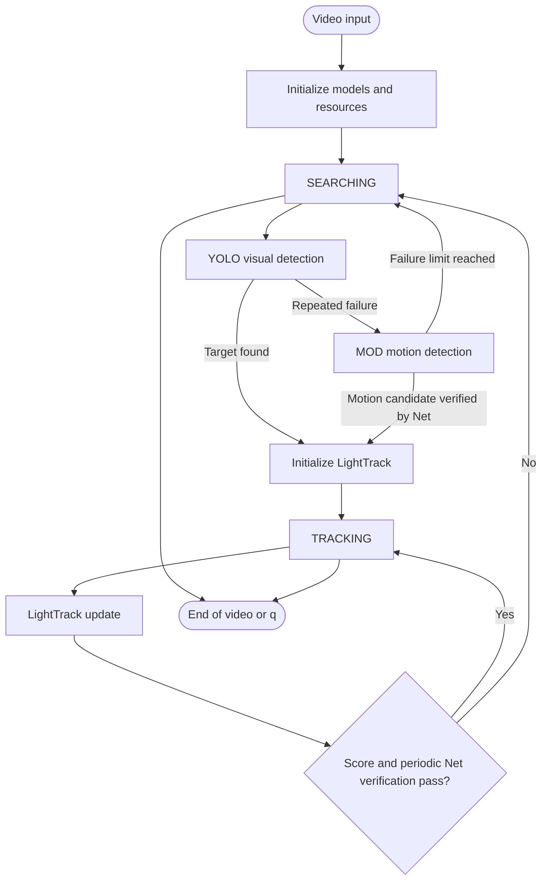

# YOLO_LT Project Overview

## 1. Project အကြောင်း

YOLO_LT သည် video ထဲရှိ အရွယ်အစားသေးငယ်သော drone များကို ရှာဖွေ၊ ခြေရာခံပြီး ဆက်လက်စစ်ဆေးနိုင်ရန် တည်ဆောက်ထားသော computer-vision system ဖြစ်သည်။ Project တွင် Python နှင့် C++ implementation နှစ်မျိုးပါဝင်ပြီး အဓိကအားဖြင့် အောက်ပါ model/algorithm များကို ပေါင်းစပ်အသုံးပြုထားသည်။

- **YOLOv5** - frame တစ်ခုလုံးတွင် drone candidate ရှာဖွေခြင်း
- **MOD (Motion Object Detection)** - camera/background motion ကိုဖယ်ပြီး ရွေ့လျားနေသော candidate ရှာဖွေခြင်း
- **LightTrack** - ရှာတွေ့ပြီးသော drone ကို frame တစ်ခုချင်းစီတွင် local search ဖြင့် ခြေရာခံခြင်း
- **Net classifier** - candidate သို့မဟုတ် tracked region သည် `drone` ဟုတ်မဟုတ် ထပ်မံစစ်ဆေးခြင်း

System ၏ အဓိကရည်ရွယ်ချက်မှာ detector ကို frame တိုင်းအပြည့်အဝသုံးစရာမလိုဘဲ target ရှာတွေ့ပြီးနောက် lightweight tracker ဖြင့် ဆက်လက်လုပ်ဆောင်ရန်ဖြစ်သည်။

## 2. System Pipeline



### State အဓိပ္ပါယ်

1. **Initialization** - model များ၊ video input နှင့် output resource များကို ပြင်ဆင်သည်။
2. **SEARCHING** - YOLO ကိုဦးစားပေးပြီး target ရှာသည်။ YOLO ဆက်တိုက်မတွေ့ပါက MOD သို့ fallback လုပ်သည်။
3. **TRACKING** - LightTrack သည် target ၏ position နှင့် size ကို frame တစ်ခုချင်းစီ update လုပ်သည်။
4. **Verification failure** - tracker score နိမ့်ခြင်း သို့မဟုတ် Net classifier က drone မဟုတ်ဟု သတ်မှတ်ခြင်းဖြစ်လျှင် SEARCHING သို့ ပြန်သည်။
5. **End** - video ပြီးဆုံးခြင်း သို့မဟုတ် user က `q` နှိပ်ခြင်းဖြင့် resource များ release လုပ်ပြီး ရပ်သည်။

အသေးစိတ် state transition များကို [application_state_workflow.md](application_state_workflow.md) တွင်ကြည့်နိုင်သည်။

## 3. Model Architecture အကျဉ်း

### YOLOv5 detector

YOLOv5 သည် 640 x 640 letterbox frame ကို input အဖြစ်ယူပြီး multi-scale detection head မှ bounding box၊ objectness နှင့် class score များထုတ်ပေးသည်။ Confidence filtering၊ coordinate scaling နှင့် NMS ပြီးနောက် confidence အမြင့်ဆုံး box ကို LightTrack initialization အတွက် အသုံးပြုသည်။

Project ထဲတွင် standard P3/P4/P5 feature scale များအပြင် P2/4 feature head ပါသော YOLOv5 configuration လည်းရှိသည်။ P2 head သည် pixel အနည်းငယ်သာရှိသော tiny drone များ၏ localization အတွက် အထောက်အကူပြုနိုင်သည်။

### LightTrack

LightTrack သည် Siamese-style tracker ဖြစ်ပြီး input နှစ်မျိုးသုံးသည်။

- **Template/exemplar crop** - target ကိုစတင်တွေ့ချိန်တွင် crop လုပ်ပြီး feature `zf` ထုတ်သည်။
- **Search crop** - နောက် frame တစ်ခုစီတွင် target အနီးမှ crop လုပ်ပြီး update model သို့ပေးသည်။

Template feature နှင့် search feature ကို point-wise correlation ဖြင့်ပေါင်းပြီး classification score map နှင့် bounding-box regression map ထုတ်သည်။ Runtime configuration သည် template size `127`၊ search size `288`၊ stride `16` နှင့် score map `18 x 18` ဖြစ်သည်။

### Net classifier

`Net` သည် 32 x 32 image crop အတွက် သေးငယ်သော binary CNN classifier ဖြစ်သည်။

```text
Conv2d(3, 6, 5) -> ReLU -> MaxPool(2)
-> Conv2d(6, 16, 5) -> ReLU -> MaxPool(2)
-> Flatten(16 x 5 x 5)
-> Linear(400, 120) -> ReLU
-> Linear(120, 84) -> ReLU
-> Linear(84, 2)
```

Class mapping သည် `0 = background` နှင့် `1 = drone` ဖြစ်သည်။ Python တွင် `Net_best.pth`၊ C++ တွင် `Net_best.onnx` ကို အသုံးပြုသည်။

### MOD

MOD သည် neural detector တစ်ခုတည်းမဟုတ်ပါ။ Gaussian blur၊ grayscale၊ global optical flow၊ homography motion compensation၊ frame difference၊ morphology၊ contour filtering၊ local optical flow နှင့် Net classifier တို့ကို ပေါင်းစပ်ထားသော algorithm ဖြစ်သည်။

Model architecture အသေးစိတ်နှင့် C++/Python ကွာခြားချက်များကို [models_architecture.md](models_architecture.md) တွင် ဖော်ပြထားသည်။

## 4. Python Implementation

Python integrated entry point သည် `inference_py/main.py` ဖြစ်သည်။

### Runtime components

- YOLO: PyTorch `.pt` သို့မဟုတ် TensorRT 8 engine wrapper
- LightTrack: TorchScript `lighttrack_init.pt` နှင့် `lighttrack_update.pt`
- Classifier: PyTorch `Net_best.pth`
- MOD: `MOD2.py` နှင့် `Functions.py`
- Device: configuration အရ CUDA

`main.py` တွင် အောက်ပါ flags များဖြင့် module များကို enable/disable လုပ်နိုင်သည်။

```python
ENABLE_CONFIG = {
    "VISUAL_DETECT": True,
    "MOTION_DETECT": True,
    "TRACKING": True,
}
```

Python startup အတွင်း LightTrack နှင့် YOLO ကို dummy input ဖြင့် warm-up လုပ်သည်။ Video output ကို timestamp ပါသော `../assets/result_YYYYMMDD_HHMMSS.mp4` ဖိုင်အဖြစ်ရေးသည်။

### Python သီးခြား classifier tool

`inference_py/infer_net.py` သည် integrated tracker မဟုတ်ဘဲ image၊ folder သို့မဟုတ် video ကို `Net_best.pth` ဖြင့် သီးခြား classify လုပ်နိုင်သော utility ဖြစ်သည်။

## 5. C++ Implementation

C++ integrated entry point သည် `inference_cpp/main.cpp` ဖြစ်သည်။ Run command သည်

```bash
cd inference_cpp
mkdir -p build
cd build
cmake ..
make -j$(nproc)
./Light_DT <model.onnx> <video_path>
```

### Runtime components

- YOLO: ONNX Runtime `YoloDetector`
- LightTrack: ONNX Runtime init/update sessions
- Classifier/MOD: ONNX Runtime `MotionDetector`
- Image/video operations: OpenCV
- GPU acceleration: ONNX Runtime CUDA provider ရရှိပါက အသုံးပြုသည်၊ မရလျှင် CPU fallback ရှိသည်

C++ program သည် YOLO model path ကို command line မှလက်ခံပြီး LightTrack နှင့် classifier model များကို executable parent project ၏ `model/` directory မှရှာသည်။ Output သည် project root ရှိ `output_video.mp4` ဖြစ်သည်။

## 6. Python နှင့် C++ တူညီချက်

နှစ်ဖက်လုံးတွင် အောက်ပါ application logic တူညီသည်။

- YOLO ဖြင့် global search စတင်ခြင်း
- YOLO repeated failure နောက် MOD သို့ fallback လုပ်ခြင်း
- Valid bbox ရလျှင် LightTrack initialize လုပ်ခြင်း
- LightTrack score ကို စစ်ပြီး target ပျောက်လျှင် search သို့ပြန်ခြင်း
- 30 frame interval ဖြင့် classifier verification လုပ်ခြင်း
- Classifier မအောင်မြင်လျှင် search သို့ပြန်ခြင်း
- Annotated frame ကို display နှင့် output video တွင်သိမ်းခြင်း

## 7. Backend ကွာခြားချက်နှင့် သတိပြုရန်များ

1. **Model format** - Python သည် `.pt`/TensorRT ကိုသုံးပြီး C++ သည် `.onnx` ကိုသုံးသည်။
2. **LightTrack execution** - Python သည် GPU tensor crop/resize နှင့် TorchScript သုံးပြီး C++ သည် OpenCV crop နှင့် ONNX Runtime သုံးသည်။
3. **Classifier preprocessing** - C++ classifier သည် BGR မှ RGB ပြောင်းသည်။ Python classifier path များတွင် `ToTensor()` သာသုံးပြီး channel order ကွာနိုင်သည်။ Backend output တူညီမှုစစ်ရန် preprocessing ကိုညှိရန်လိုသည်။
4. **YOLO class filtering** - လက်ရှိ integrated path များတွင် confidence အမြင့်ဆုံး box ကိုရွေးသော်လည်း class id filtering ကို သီးခြားမပြည့်စုံစွာ မလုပ်ထားပါ။
5. **Model path** - Python video/model paths အချို့သည် hard-coded absolute/relative path ဖြစ်သောကြောင့် အခြားစက်တွင် run မလုပ်မီ ပြင်ရန်လိုသည်။
6. **Tracking disabled** - `TRACKING` ပိတ်ထားလျှင် detection-only mode အဖြစ် output တည်ငြိမ်စွာထားခြင်းမဟုတ်ဘဲ frame တိုင်း search ပြန်လုပ်သည့် behavior ဖြစ်သည်။
7. **Anti-drift** - C++/Python wrapper များတွင် anti-jump helper ရှိသော်လည်း integrated main loop တွင် active မဖြစ်နိုင်သော code path များရှိသည်။
8. **Tiny-object tradeoff** - P2 high-resolution head သည် small-object recall တိုးစေနိုင်သော်လည်း memory နှင့် inference latency တိုးနိုင်သည်။

## 8. Project Directory အညွှန်း

```text
YOLO_LT/
├── overview.md
├── README.md
├── application_state_workflow.md
├── models_architecture.md
├── assets/
├── inference_cpp/
│   ├── main.cpp
│   ├── include/
│   ├── src/
│   ├── model/
│   └── CMakeLists.txt
└── inference_py/
    ├── main.py
    ├── infer_net.py
    ├── MOD2.py
    ├── Functions.py
    ├── LightTrack_FastTrack.py
    ├── modules_trt10/
    ├── lib/
    ├── model/
    └── yolov5/
```

## 9. လိုအပ်ချက်များ

### Python

- Python environment
- PyTorch နှင့် CUDA
- OpenCV
- TensorRT 8.6 သို့မဟုတ် project configuration နှင့်ကိုက်ညီသော TensorRT runtime
- PyCUDA သို့မဟုတ် သက်ဆိုင်ရာ GPU packages
- YOLOv5 local dependencies

### C++

- C++17 compiler
- CMake 3.10 နှင့်အထက်
- OpenCV 4.6 နှင့်အထက်
- ONNX Runtime နှင့် CUDA provider libraries
- GUI ပြသရန် OpenCV GUI backend

## 10. အသုံးပြုရန်အခြေခံအဆင့်များ

### Python integrated inference

```bash
cd inference_py
python main.py
```

Run မလုပ်မီ `main.py` ထဲရှိ အောက်ပါအချက်များကို စစ်ဆေးပါ။

- `VIDEO_PATH`
- `DEVICE`
- `USE_TENSORRT_10`
- YOLO model path
- LightTrack model paths
- `Net_best.pth` path
- `ENABLE_CONFIG`

### C++ integrated inference

```bash
cd inference_cpp
mkdir -p build && cd build
cmake ..
make -j$(nproc)
./Light_DT <model.onnx> <video_path>
```

### Standalone classifier

```bash
cd inference_py
python infer_net.py <image-or-folder-or-video> --weights ./model/Net_best.pth --device cuda
```

## 11. စမ်းသပ်ခြင်းနှင့် ထပ်မံတိုးချဲ့နိုင်သောအချက်များ

Project တွင် ARD-MAV နှင့် GDUT-HWD dataset များအတွက် ablation scripts ပါရှိသည်။

```bash
cd inference_py
python ablation_ARD.py
python ablation_GDUT.py
```

Production အသုံးပြုရန် မတိုင်မီ အောက်ပါ validation များပြုလုပ်သင့်သည်။

1. Python/C++ တူညီသော crop နှင့် input tensor ဖြင့် classifier parity test လုပ်ရန်
2. YOLO model ၏ class mapping နှင့် C++ class filtering ကို အတည်ပြုရန်
3. Model path များကို configuration/CLI သို့ ပြောင်းရန်
4. Output bbox coordinate format ကို detector နှစ်ဖက်တွင် တူညီကြောင်းစစ်ရန်
5. CPU/GPU fallback နှင့် output writer failure ကို သီးခြားစမ်းရန်
6. Tracker score threshold နှင့် classifier interval ကို dataset အလိုက် tune လုပ်ရန်
7. MOD optical-flow cost နှင့် high-resolution P2 head cost ကို FPS/memory ဖြင့် တိုင်းတာရန်

## 12. ဆက်စပ်စာတမ်းများ

- [Application State Workflow](application_state_workflow.md) - runtime state နှင့် state transition အသေးစိတ်
- [Model Architectures](models_architecture.md) - model layers၊ tensor flow နှင့် backend implementation အသေးစိတ်
- [Original README](README.md) - project ၏ မူရင်း run instructions နှင့် structure