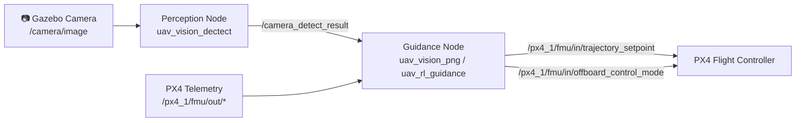
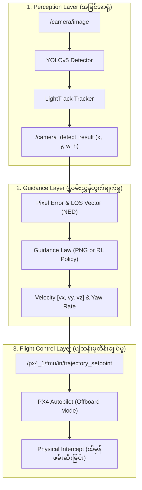
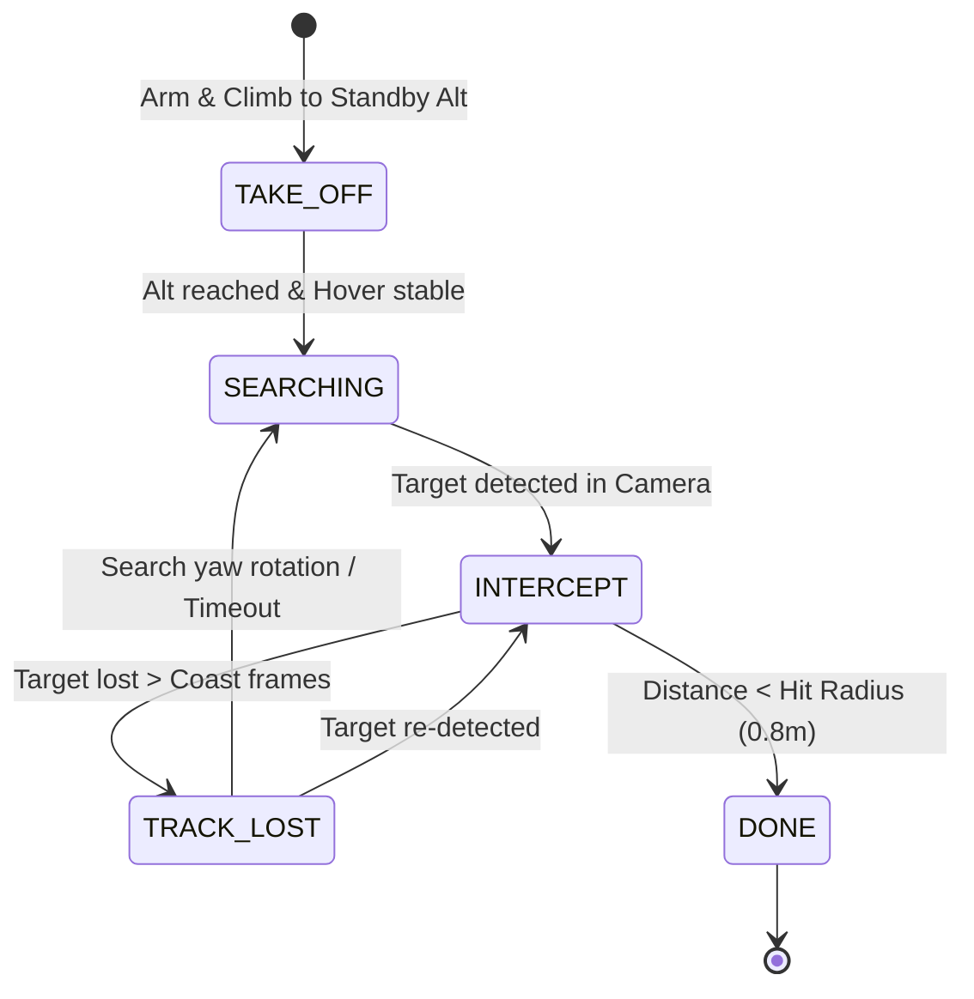
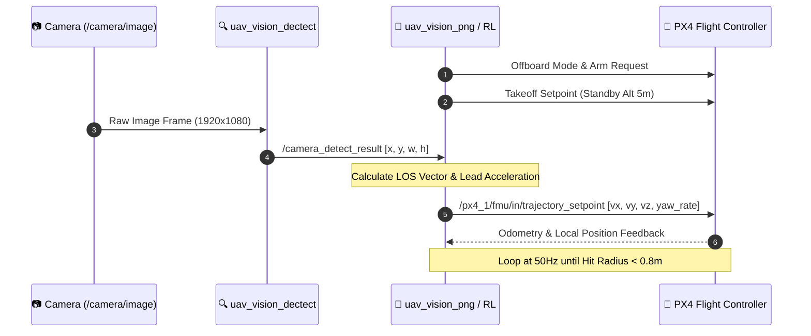

# Interceptor Drone (Drone 1) အသေးစိတ်လေ့လာမှု လမ်းညွှန်

> ဤမှတ်တမ်းသည် **Drone 1 (Interceptor / လိုက်ဖမ်းမည့် ကြားဖြတ်ဒရုန်း)** ၏ ROS 2 Topics များ၊ စနစ်တည်ဆောက်ပုံနှင့် **ပစ်မှတ်ကို မည်သို့ရှာဖွေပြီး မည်သို့ကြားဖြတ်တိုက်ခိုက် (Intercept) သလဲ** ဆိုသည့် အဆင့်ဆင့် Algorithm လုပ်ဆောင်ချက်များကို အသေးစိတ် ရှင်းပြထားပါသည်။

---

## ၁။ Interceptor Drone ၏ Hardware & Simulation ဖွဲ့စည်းပုံ

* **Model**: `gz_x500_depth` (Instance 1)
* **Sensor**: ရှေ့မျက်နှာမူ တပ်ဆင်ထားသော RGB/Depth Camera (`IMX214`)
* **Flight Controller**: PX4 Autopilot (SITL) Offboard Mode
* **Simulation World**: Gazebo Sim (`grass_world`)
* **Camera Bridge**: Gazebo topic မှတစ်ဆင့် ROS 2 `/camera/image` သို့ တိုက်ရိုက် ချိတ်ဆက်ထားသည်။

---

## ၂။ Interceptor Drone (Drone 1) အသုံးပြုသော Topics များ

Interceptor Drone တွင် အဓိက topics များကို **Capture (ဒေတာ လက်ခံခြင်း)** နှင့် **Runner (Command ပေးပို့ခြင်း)** ဟူ၍ ၂ မျိုး ခွဲခြားထားပါသည် -

### 📥 Capture Topics (Subscribe ပြုလုပ်သော Topics)

| Topic အမည် | Message Type | တာဝန်နှင့် အဓိပ္ပာယ် |
|---|---|---|
| `/camera/image` | `sensor_msgs/msg/Image` | ဒရုန်း၏ ရှေ့ကင်မရာမှ ရရှိသော Video Frame (RGB Image) |
| `/camera_detect_result` | `uav_common_msg/msg/RectMsg` | YOLO + Tracker မှ ထွက်လာသော ပစ်မှတ်၏ နေရာ Bounding Box `(x, y, w, h)` |
| `/px4_1/fmu/out/vehicle_odometry` | `px4_msgs/msg/VehicleOdometry` | ဒရုန်း၏ အနေအထား Quaternion `(q0, q1, q2, q3)` မှတစ်ဆင့် Roll, Pitch, Yaw ထုတ်ယူရန် |
| `/px4_1/fmu/out/vehicle_local_position` | `px4_msgs/msg/VehicleLocalPosition` | ဒရုန်း၏ လက်ရှိ NED အမြန်နှုန်း `(vx, vy, vz)` နှင့် အမြင့် `z` |
| `/px4_1/fmu/out/vehicle_status` | `px4_msgs/msg/VehicleStatus` | ဒရုန်း Arm ဖြစ်/မဖြစ်နှင့် Offboard mode အခြေအနေ စစ်ဆေးရန် |
| `/px4_1/fmu/out/hover_thrust_estimate` | `px4_msgs/msg/HoverThrustEstimate` | လေထဲ ငြိမ်ငြိမ်ရပ် (Hover) နိုင်ရန် လိုအပ်သော Thrust ပမာဏ |
| `/px4_1/fmu/out/vehicle_gps_position` | `px4_msgs/msg/SensorGps` | ဒရုန်း၏ ကမ္ဘာ့မြေပြင် GPS နေရာ |

---

### 📤 Runner Topics (Publish ပြုလုပ်သော Topics)

| Topic အမည် | Message Type | တာဝန်နှင့် အဓိပ္ပာယ် |
|---|---|---|
| `/px4_1/fmu/in/offboard_control_mode` | `px4_msgs/msg/OffboardControlMode` | PX4 အား Velocity Control အသုံးပြုမည်ဖြစ်ကြောင်း အသိပေးသည့် Heartbeat Signal (200 Hz) |
| `/px4_1/fmu/in/trajectory_setpoint` | `px4_msgs/msg/TrajectorySetpoint` | ဒရုန်း ပျံသန်းရမည့် ဦးတည်ရာ NED Velocity `[vx, vy, vz]` နှင့် Yaw Rate `yawspeed` command များ |
| `/px4_1/fmu/in/vehicle_command` | `px4_msgs/msg/VehicleCommand` | ဒရုန်းကို Arm လုပ်ရန်နှင့် Offboard Mode ပြောင်းရန် Command |
| `/camera_detect_result` | `uav_common_msg/msg/RectMsg` | Detection Node မှ Guidance Node သို့ ပစ်မှတ် Bounding Box ပေးပို့ခြင်း |
| `/vpng_data` (သို့) `/los_data` | `uav_common_msg/msg/Data` | Guidance လုပ်ဆောင်ချက်များကို Plot ထုတ်ကြည့်ရန် Telemetry/Debug Data များ |

### 🔄 ROS 2 Topics Data Flow (Mermaid Diagram)

---

## ၃။ Interceptor Drone ဘယ်လို အလုပ်လုပ်သလဲ (How It Intercepts)

Interceptor Drone သည် အဆင့် (၄) ဆင့်ပါဝင်သော **Closed-Loop Visual Interception Pipeline** ဖြင့် အလုပ်လုပ်ပါသည် -

---

### အဆင့် (၁) - Perception Layer (ပစ်မှတ်ကို ကင်မရာဖြင့် ရှာဖွေခြင်း)
* **Node**: [`uav_vision_dectect`](file:///home/mr_robot/Desktop/Git/Autonomous_Intercept_Drone/uav_vision_dectect/src/uav_topic_subscrib.cpp)
* **Model**: **YOLOv5** (TensorRT / ONNX) + **LightTrack** (SiamTracker)
* ဒရုန်းရှေ့ရှိ ကင်မရာမှ Video Frame ရောက်လာသည်နှင့် YOLO detector က target drone ကို ရှာဖွေသည်။
* တွေ့ရှိပါက ပစ်မှတ်၏ မျက်နှာပြင် Bounding Box `(x, y, width, height)` ကို တွက်ထုတ်ပြီး `/camera_detect_result` သို့ publish လုပ်ပေးသည်။
* ပစ်မှတ်မရှိပါက `width = -1` အဖြစ် ပေးပို့သည်။

---

### အဆင့် (၂) - Line of Sight (LOS) နှင့် Coordinate Transformation
* **Node**: [`uav_vision_png`](file:///home/mr_robot/Desktop/Git/Autonomous_Intercept_Drone/uav_vision_png/src/vision_png_control.cpp)
* ကင်မရာ ပုံရိပ်၏ အလယ်ဗဟို $(c_x, c_y)$ နှင့် ပစ်မှတ် ဗဟိုကြား ကွာဟချက် (Pixel Errors):
  $$e_x = (x + \frac{w}{2}) - c_x$$
  $$e_y = (y + \frac{h}{2}) - c_y$$
* ကင်မရာ မျဉ်းဆွဲအား (Camera-frame LOS Vector):
  $$N_t = \begin{bmatrix} e_x \\ e_y \\ f \end{bmatrix} \quad (f = \text{Focal Length})$$
* **Coordinate Conversion (Axes Alignment)**:
  ကင်မရာစနစ် (Camera Frame) $\to$ ဒရုန်းကိုယ်ထည် (Body Frame) $\to$ ကမ္ဘာ့မြေပြင်စနစ် (NED Frame) သို့ Rotation Matrix များဖြင့် လှည့်ပေးပါသည် -
  $$N_{t,ned} = R_{b2n}(\text{roll, pitch, yaw}) \cdot R_{c2b} \cdot N_t$$
* ထိုမှတစ်ဆင့် ဒရုန်းနှင့် ပစ်မှတ်ကြားရှိ **LOS Elevation Angle** ($LOS_v$) နှင့် **Azimuth Angle** ($LOS_z$) ကို ရရှိသည်။

---

### အဆင့် (၃) - Guidance Algorithm (ကြားဖြတ်ပျံသန်းမှု တွက်ချက်ခြင်း)

Interceptor Drone တွင် အောက်ပါ Algorithm များကို အသုံးပြုနိုင်ပါသည် -

#### က။ Proportional Navigation Guidance (PNG) — အဓိက သုံးထားသော နည်းလမ်း
ဒုံးကျည်များ (Missiles) တွင် အသုံးပြုသော ကြားဖြတ်ဖမ်းဆီးရေး နည်းဥပဒေသဖြစ်ပါသည်။ ပစ်မှတ်ရှိနေသည့် နေရာနောက်သို့ တကောက်ကောက် လိုက်ခြင်း မဟုတ်ဘဲ၊ ပစ်မှတ်သွားမည့် လမ်းကြောင်းကို **ကြိုတင်ခန့်မှန်းဖြတ်တောက် (Lead Angle Intercept)** ပျံသန်းခြင်း ဖြစ်ပါသည် -
* **PNG Core Formula**:
  $$d\_v\_angle_v = k_v \cdot \Delta LOS_v + last\_v\_angle_v$$
  $$d\_v\_angle_z = k_z \cdot \Delta LOS_z + last\_v\_angle_z$$
* **FOV Lock-on (Yaw Rate Control)**:
  ပစ်မှတ်ကို ကင်မရာ မြင်ကွင်းအလယ်တွင် အမြဲရှိနေစေရန် ဒရုန်း၏ ခေါင်းလှည့်နှုန်းကို PD Controller ဖြင့် ထိန်းချုပ်သည် -
  $$d_{yaw} = k_{1} \cdot e_x + k_{2} \cdot \frac{de_x}{dt}$$
* **Pitch Drop Compensation**:
  ဒရုန်းသည် အရှိန်တင်၍ ရှေ့သို့ ပြေးသောအခါ ခေါင်းငိုက်စိုက်ကျသွားသဖြင့် ကင်မရာပါ အောက်ငိုက်သွားတတ်သည်။ ထိုအချက်ကို ကာကွယ်ရန် $e_y$ pixel error ပေါ်မူတည်၍ $v_z$ ထဲသို့ ဒေါင်လိုက်အလျင် လျော်ကြေးပေါင်းထည့်ပေးသည် ($v_z += k_{ey} \cdot e_y$)။

#### ခ။ Reinforcement Learning Guidance (`uav_rl_guidance`) — အဆင့်မြင့် နည်းလမ်း
* Traditional PNG နေရာတွင် **GRU Policy Reinforcement Learning Model (ONNX Runtime)** ဖြင့် အစားထိုးနိုင်ပါသည်။
* ဒရုန်း၏ လက်ရှိအမြန်နှုန်း၊ အနေအထားနှင့် ပစ်မှတ် နေရာ feature များကို Neural Network ထဲ ထည့်သွင်းပြီး အကောင်းဆုံး အမြန်နှုန်း command များကို တိုက်ရိုက် တွက်ထုတ်ပေးသည်။

---

### အဆင့် (၄) - Finite State Machine (FSM အဆင့်ဆင့် ထိန်းချုပ်မှု)

[`vision_png_control.cpp`](file:///home/mr_robot/Desktop/Git/Autonomous_Intercept_Drone/uav_vision_png/src/vision_png_control.cpp) တွင် ဒရုန်း၏ အခြေအနေကို အောက်ပါ State (၅) ခုဖြင့် စီမံထားပါသည် -

1. **`TAKE_OFF` (တက်ရောက်ခြင်း)**:
   * ဒရုန်းကို Arm လုပ်ပြီး Standby Altitude (ဥပမာ- ၅ မီတာ) သို့ Position Setpoint ဖြင့် တက်ရောက်စေသည်။
   * Hover Thrust တည်ငြိမ်သွားသည်အထိ စောင့်ဆိုင်းသည်။
2. **`SEARCHING` (ပစ်မှတ်ရှာဖွေခြင်း)**:
   * သတ်မှတ်အမြင့်တွင် ငြိမ်ငြိမ်ရပ် (Hover) ပြီး ကင်မရာထဲ ပစ်မှတ်ရောက်လာမည့် အချိန်ကို စောင့်သည်။
   * YOLO Detection မှ Target တွေ့သည်နှင့် `INTERCEPT` အဆင့်သို့ ကူးပြောင်းသည်။
3. **`INTERCEPT` (ကြားဖြတ်တိုက်ခိုက်ခြင်း)**:
   * PNG Algorithm ဖြင့် တွက်ထားသော $v_x, v_y, v_z$ နှင့် $yaw_{rate}$ ကို 200 Hz နှုန်းဖြင့် PX4 ထံ စဉ်ဆက်မပြတ် ပို့ပေးသည်။
   * အမြန်နှုန်းကို သတ်မှတ်ထားသော Max Speed (ဥပမာ- 8 m/s) အထိ တင်၍ ပစ်မှတ်ဆီသို့ တိုးကပ်သည်။
4. **`TRACK_LOST` (ပစ်မှတ် ပျောက်ဆုံးသွားပါက ဖြေရှင်းခြင်း)**:
   * အကယ်၍ ပစ်မှတ် ခေတ္တပျောက်သွားပါက (Coast Frames) နောက်ဆုံးသိရှိခဲ့သော အမြန်နှုန်းအတိုင်း ဆက်လက်ပြေးသည်။
   * ကြာရှည်စွာ ပျောက်ဆုံးသွားပါက ရပ်တန့်ပြီး ပစ်မှတ်ကို ပြန်လည်ရှာဖွေရန် ဖြည်းညှင်းစွာ ခေါင်းလှည့်လှည့်လည်ကြည့်ရှုသည်။
5. **`DONE` (ထိမှန်ပြီးစီးခြင်း)**:
   * ပစ်မှတ်နှင့် အကွာအဝေးသည် Hit Radius (ဥပမာ- 0.8 မီတာ အတွင်း) ရောက်ရှိသွားပါက Intercept အောင်မြင်သည်ဟု သတ်မှတ်ပြီး ရပ်တန့်သည်။

---

## ၄။ အကျဉ်းချုပ် စနစ်လည်ပတ်ပုံဇယား

