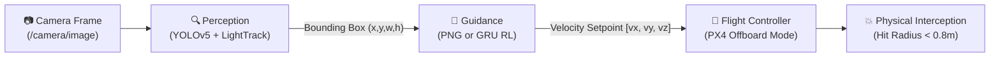
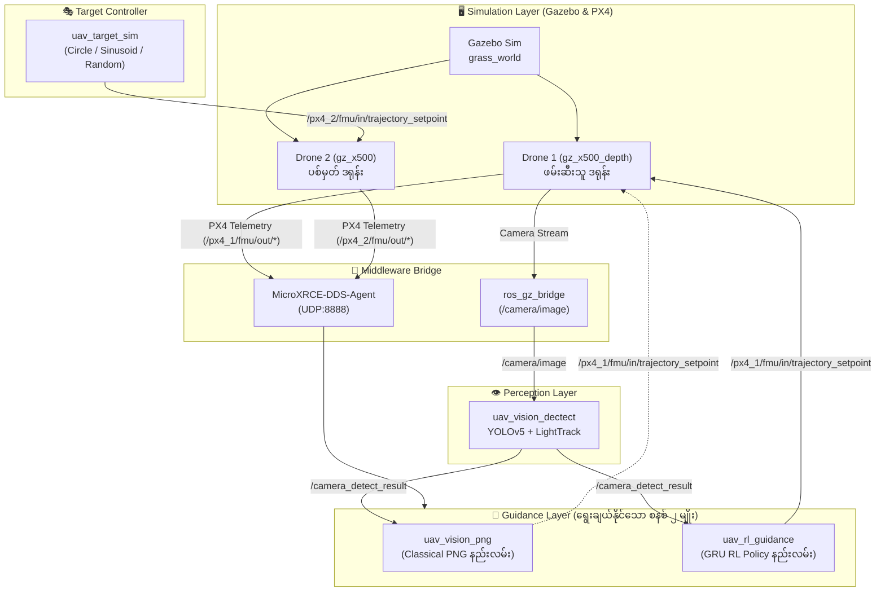
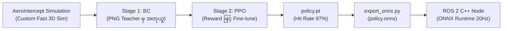
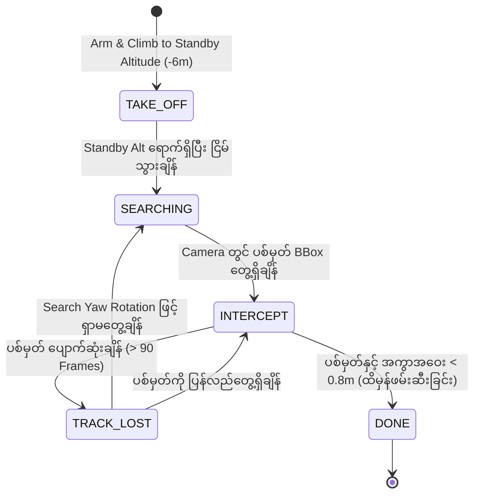
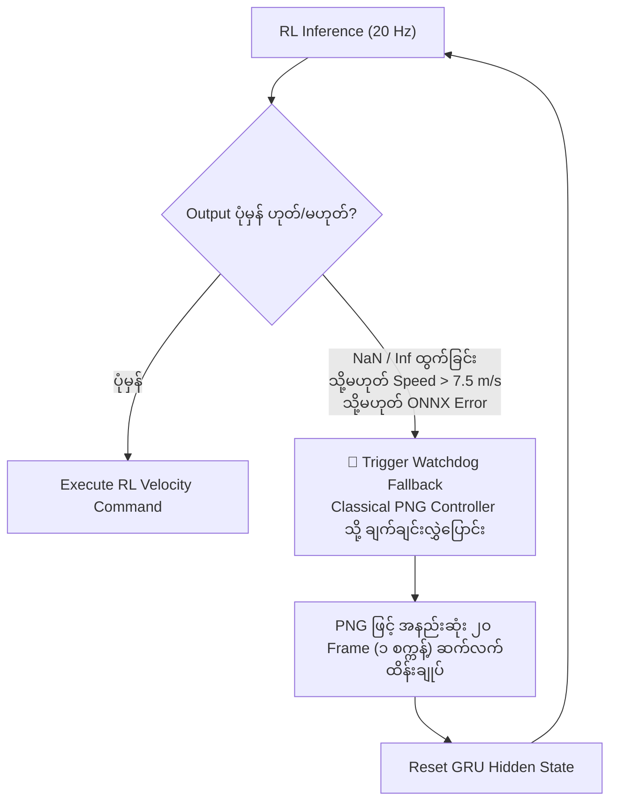

# 🚁 Autonomous Intercept Drone — စနစ်ခွဲခြမ်းစိတ်ဖြာမှု မှတ်တမ်း

> **Repository**: [Autonomous_Intercept_Drone](file:///home/mr_robot/Desktop/Git/Autonomous_Intercept_Drone)  
> **အဓိက နည်းပညာများ**: ROS 2 Humble, PX4 Autopilot (SITL v1.16), Gazebo Sim (Harmonic), C++, ONNX Runtime  
> **စာတမ်းရည်ရွယ်ချက်**: ဤ Project ၏ အစိတ်အပိုင်းများ၊ ROS 2 Packages များ၊ Perception မှ Guidance ထိန်းချုပ်မှုအထိ အလုပ်လုပ်ပုံနှင့် RL Model အသုံးချပုံတို့ကို ရှင်းလင်းလွယ်ကူစွာ နားလည်နိုင်စေရန် ရေးသားထားပါသည်။

---

## ၁။ စနစ် ခြုံငုံသုံးသပ်ချက် (System Overview)

ဤ Project သည် **Image-based Visual Intercept Drone System** ဖြစ်ပြီး၊ ဒရုန်း (၂) စီးကို Gazebo Simulation တွင် ပျံသန်းစေကာ ဖမ်းဆီးသူဒရုန်းမှ ပစ်မှတ်ဒရုန်းကို အလိုအလျောက် ရှာဖွေပြီး ကြားဖြတ်တိုက်ခိုက် (Intercept) သည့် စနစ်ဖြစ်ပါသည်:

* **Drone 1 (Interceptor / ဖမ်းဆီးသူ)**: ရှေ့ကြည့် RGB Camera (`IMX214`) တပ်ဆင်ထားပြီး Visual AI မော်ဒယ်များနှင့် Guidance Algorithm သုံးကာ ပစ်မှတ်ကို လိုက်လံတိုက်ခိုက်သည်။
* **Drone 2 (Target / ပစ်မှတ်)**: သတ်မှတ်ထားသော ပျံသန်းမှုပုံစံများ (Circle, Sinusoidal, Random Walk) ဖြင့် ပျံသန်းနေသော ပစ်မှတ်ဖြစ်သည်။



| အစိတ်အပိုင်း | အသုံးပြုထားသော နည်းပညာ / ဗားရှင်း |
|---|---|
| **Simulator** | Gazebo Harmonic (`gz-sim 8.12.0`) + World: `grass_world` |
| **Autopilot** | PX4 SITL v1.16 (Offboard Mode ထိန်းချုပ်မှု) |
| **Middleware** | ROS 2 Humble + MicroXRCE-DDS-Agent (UDP:8888) |
| **Perception Model** | YOLOv5 Detector (`GDUT_UAV.onnx`) + LightTrack (`lighttrack_init/update.onnx`) |
| **Guidance System** | Classical PNG (`uav_vision_png`) သို့မဟုတ် RL GRU Policy (`uav_rl_guidance`) |
| **RL Performance** | **97% Hit Rate** (ပစ်မှတ်ကို အောင်မြင်စွာ ကြားဖြတ်ဖမ်းဆီးနိုင်မှုနှုန်း) |

---

## ၂။ စနစ် ဗိသုကာပုံ (System Architecture)

စနစ်တစ်ခုလုံး၏ ROS 2 Nodes များ၊ Simulation နှင့် ဒေတာ စီးဆင်းမှု (Data Flow) ကို အောက်ပါအတိုင်း ဖွဲ့စည်းထားပါသည်:



---

## ၃။ Package များ ဖွဲ့စည်းပုံနှင့် အခန်းကဏ္ဍ

ဤ Workspace တွင် ပါဝင်သော ROS 2 Packages များကို ၎င်းတို့၏ လုပ်ဆောင်ချက်အလိုက် ရှင်းလင်းစွာ ခွဲခြားထားပါသည်:

### က။ အဓိက အသုံးပြုနေသော Packages (Active Packages)

| Package အမည် | တာဝန်ယူထားသည့် အခန်းကဏ္ဍ | အဓိကဖိုင်များ |
|---|---|---|
| [`uav_vision_dectect`](file:///home/mr_robot/Desktop/Git/Autonomous_Intercept_Drone/uav_vision_dectect) | ကင်မရာပုံရိပ်မှ ပစ်မှတ်ဒရုန်းကို ရှာဖွေပြီး Bounding Box ထုတ်ပေးခြင်း | [`uav_topic_subscrib.cpp`](file:///home/mr_robot/Desktop/Git/Autonomous_Intercept_Drone/uav_vision_dectect/src/uav_topic_subscrib.cpp) |
| [`uav_rl_guidance`](file:///home/mr_robot/Desktop/Git/Autonomous_Intercept_Drone/uav_rl_guidance) | **အဓိက Guidance စနစ်** — GRU Policy (ONNX Runtime) ဖြင့် အမြန်နှုန်း အမိန့်များ ထုတ်ပေးခြင်း | [`rl_guidance_node.cpp`](file:///home/mr_robot/Desktop/Git/Autonomous_Intercept_Drone/uav_rl_guidance/src/rl_guidance_node.cpp) |
| [`uav_vision_png`](file:///home/mr_robot/Desktop/Git/Autonomous_Intercept_Drone/uav_vision_png) | **Baseline Guidance စနစ်** — Classical သင်္ချာနည်း (PNG) ဖြင့် ထိန်းကျောင်းခြင်း | [`vision_png_control.cpp`](file:///home/mr_robot/Desktop/Git/Autonomous_Intercept_Drone/uav_vision_png/src/vision_png_control.cpp) |
| [`uav_target_sim`](file:///home/mr_robot/Desktop/Git/Autonomous_Intercept_Drone/uav_target_sim) | ပစ်မှတ်ဒရုန်း (Drone 2) အား လှုပ်ရှားပျံသန်းစေရန် Trajectory ဖန်တီးပေးခြင်း | [`uav_target_sim.cpp`](file:///home/mr_robot/Desktop/Git/Autonomous_Intercept_Drone/uav_target_sim/src/uav_target_sim.cpp) |
| [`uav_common_msg`](file:///home/mr_robot/Desktop/Git/Autonomous_Intercept_Drone/uav_common_msg) | Node များအချင်းချင်း ဒေတာဖလှယ်ရာတွင် သုံးသော Custom Messages (`RectMsg`, `Data`) | `RectMsg.msg`, `Data.msg` |
| [`px4_msgs`](file:///home/mr_robot/Desktop/Git/Autonomous_Intercept_Drone/px4_msgs) | PX4 Autopilot နှင့် တိုက်ရိုက် ဆက်သွယ်သော ROS 2 Messages များ | `TrajectorySetpoint.msg`, စသည် |

### ခ။ အထောက်အကူပြု နှင့် စမ်းသပ်မှု Packages (Utilities & Legacy)

* [`px4_ros_com`](file:///home/mr_robot/Desktop/Git/Autonomous_Intercept_Drone/px4_ros_com): PX4 နှင့် ROS 2 ကြား အချိန်နှင့်တပြေးညီ ချိတ်ဆက်မှု အထောက်အကူပြု Library။
* [`uav_bc_recorder`](file:///home/mr_robot/Desktop/Git/Autonomous_Intercept_Drone/uav_bc_recorder): Behavioral Cloning အတွက် ပျံသန်းမှု ဒေတာများ စုဆောင်းမှတ်တမ်းတင်သည့် Node။
* [`uav_keyboard_control`](file:///home/mr_robot/Desktop/Git/Autonomous_Intercept_Drone/uav_keyboard_control): စမ်းသပ်ရာတွင် ဒရုန်းကို လက်ဖြင့် Keyboard ဖြင့် ထိန်းချုပ်မောင်းနှင်နိုင်သည့် Node။
* [`uav_png_intercept`](file:///home/mr_robot/Desktop/Git/Autonomous_Intercept_Drone/uav_png_intercept) / [`uav_ibvs_control`](file:///home/mr_robot/Desktop/Git/Autonomous_Intercept_Drone/uav_ibvs_control): ယခင် အစောပိုင်း သုတေသနပြုလုပ်ခဲ့သော ရှေးဟောင်း Guidance Node များ (လက်ရှိတွင် `uav_vision_png` နှင့် `uav_rl_guidance` ဖြင့် အစားထိုးထားပြီးဖြစ်သည်)။

---

## ၄။ Guidance နည်းလမ်း (၂) ခု နှိုင်းယှဉ်ချက် (PNG vs RL)

Interceptor Drone တွင် အသုံးပြုနိုင်သော လမ်းညွှန်နည်းလမ်း (၂) ခု ကွာခြားချက်မှာ အောက်ပါအတိုင်း ဖြစ်ပါသည်:

| အချက် | Classical PNG (`uav_vision_png`) | RL Policy (`uav_rl_guidance`) |
|---|---|---|
| **သဘောတရား** | သင်္ချာနည်းအရ LOS Angle ပြောင်းလဲနှုန်းကို အခြေခံတွက်ချက် | Neural Network (GRU) မှ တိုက်ရိုက် Action ဆုံးဖြတ် |
| **Model လိုအပ်မှု** | Model လုံးဝမလို (Pure Math) | ONNX Model လိုအပ် (`policy.onnx` ~258 KB) |
| **ပစ်မှတ်ကွယ်သွားချိန် (Occlusion)** | မျက်ကွယ်ပျောက်ပါက အရှိန်ထိန်း၍ မျောပျံရုံသာ တတ်နိုင် | GRU Memory မှတဆင့် လမ်းကြောင်းကို ကြိုတင်ခန့်မှန်းနိုင် |
| **ရှောင်တိမ်းသော ပစ်မှတ်များ** | ပစ်မှတ် ရုတ်တရက် အပြောင်းအလဲလုပ်ပါက လွဲချော်နိုင်ခြေရှိ | မတူညီသော ပျံသန်းမှုပုံစံများဖြင့် Train ထား၍ Hit Rate ပိုမိုမြင့်မား |
| **လုံခြုံရေး အကာအကွယ်** | မလိုပါ | **Watchdog ပါဝင်** (AI မှားယွင်းပါက PNG သို့ အလိုအလျောက် Fallback) |

---

## ၅။ RL Guidance Model လေ့ကျင့်ထားပုံ (RL Training Summary)

> အသေးစိတ် လေ့ကျင့်ပုံအပြည့်အစုံကို [04_how_to_train_RL.md](file:///home/mr_robot/Desktop/Git/Autonomous_Intercept_Drone/04_how_to_train_RL.md) တွင် သီးသန့်ဖော်ပြထားပါသည်။



* **လေ့ကျင့်သည့် ပတ်ဝန်းကျင်**: Gazebo ပေါ်တွင် တိုက်ရိုက် မလေ့ကျင့်ဘဲ **AeroIntercept** Fast Python Simulation ပေါ်တွင် Parallel Steps သန်းပေါင်းများစွာ အလျင်အမြန် လေ့ကျင့်ခဲ့ခြင်းဖြစ်သည်။
* **2-Stage Hybrid Learning**:
  1. **Behavioral Cloning (BC)**: Cold-start မဖြစ်စေရန် PNG Teacher ၏ ပျံသန်းမှုများကို ကြိုတင်ကူးယူ လေ့ကျင့်သည်။
  2. **PPO (Proximal Policy Optimization)**: Hit Reward, Distance Reward, Smoothness Penalty များဖြင့် စွမ်းရည်အမြင့်မားဆုံးရောက်အောင် Fine-tune လုပ်သည်။
* **Input / Output**:
  * **Observation (15-dim)**: LOS Elevation/Azimuth Angles, LOS Angular Rates, Bounding Box Sizes, Valid Flag, Age, Drone Velocities, Altitude.
  * **Action (4-dim)**: Elevation Adjustment, Azimuth Adjustment, Speed (2.0 ~ 5.0 m/s), Yaw Rate.

---

## ၆။ Drone ၏ အဆင့်ဆင့် ထိန်းချုပ်မှု (Finite State Machine)

Guidance Node အတွင်း၌ ဒရုန်း၏ အခြေအနေကို အောက်ပါ State (၅) ခုဖြင့် စီမံထိန်းချုပ်ထားပါသည်:



1. **`TAKE_OFF`**: ဒရုန်းကို Arm လုပ်ပြီး Standby Altitude (ဥပမာ- ၆ မီတာ) အမြင့်သို့ တက်ရောက်စေသည်။
2. **`SEARCHING`**: သတ်မှတ်အမြင့်တွင် ငြိမ်ငြိမ်ရပ် (Hover) ပြီး ကင်မရာထဲ ပစ်မှတ်ရောက်လာမည့် အချိန်ကို စောင့်သည်။
3. **`INTERCEPT`**: Guidance Law (PNG သို့မဟုတ် RL) ဖြင့် ပစ်မှတ်ဆီသို့ အရှိန်တင်၍ ဖြတ်တောက် ပျံသန်းသည်။
4. **`TRACK_LOST`**: ပစ်မှတ် ခေတ္တပျောက်သွားပါက အရှိန်ထိန်း ပျံသန်းပြီး၊ ကြာရှည်ပျောက်ပါက ခေါင်းလှည့်၍ ပြန်လည်ရှာဖွေသည်။
5. **`DONE`**: ပစ်မှတ်နှင့် အကွာအဝေးသည် Hit Radius (0.8 မီတာ) အတွင်း ရောက်ရှိသွားပါက ရပ်တန့်သည်။

---

## ၇။ ပစ်မှတ် ဒရုန်း၏ ပျံသန်းမှု Mode များ (`uav_target_sim`)

စမ်းသပ်မှုများ ပြုလုပ်ရာတွင် ပစ်မှတ် Drone (Drone 2) သည် အောက်ပါ Mode (၃) ခုဖြင့် လှုပ်ရှားနိုင်ပါသည်:

| Mode | Parameter | ပျံသန်းမှု ပုံစံ | အသုံးဝင်ပုံ |
|---|---|---|---|
| **ဝိုင်းပတ်ပျံသန်းခြင်း** | `circle` (Default) | $R=5\text{m}$, အမြန်နှုန်း ပုံမှန်ဖြင့် စက်ဝိုင်းပုံ ပျံသန်း | အခြေခံ Intercept စွမ်းရည် စမ်းသပ်ရန် |
| **လှိုင်းတွန့်ပျံသန်းခြင်း** | `sinusoidal` | ရှေ့သို့ $1\text{ m/s}$ သွားရင်း ဘေးဘက်သို့ S-curve ပုံစံ ကွေ့ဝိုက် | ဘေးဘက်တိမ်းရှောင်သော ပစ်မှတ်အား စမ်းသပ်ရန် |
| **ကျပန်း လှုပ်ရှားခြင်း** | `random_walk` | အရှိန်နှင့် ဦးတည်ရာကို ကျပန်းပြောင်းလဲ ($< 3\text{ m/s}$) | ခန့်မှန်းရခက်သော တကယ့် အခြေအနေများကို စမ်းသပ်ရန် |

---

## ၈။ လုံခြုံရေး Watchdog အကာအကွယ်စနစ်

RL Guidance Model သုံးစွဲနေစဉ် မော်ဒယ်မှ အမှားအယွင်းများ ထွက်ပေါ်လာပါက ဒရုန်း ပျက်ကျမှုမဖြစ်စေရန် C++ Node အတွင်း **Watchdog Mechanism** ပါရှိသည်:



---

## ၉။ Simulation စတင် မောင်းနှင်ပုံ အဆင့်ဆင့် (Execution Steps)

```bash
# အဆင့် ၁: Terminal 1 — Gazebo Sim နှင့် Dual Drone စတင်ပါ
cd /home/mr_robot/Desktop/Git/Autonomous_Intercept_Drone
./run_swarm.sh

# အဆင့် ၂: Terminal 2 — Target Simulator ကို run ပါ
ros2 run uav_target_sim uav_target_sim

# အဆင့် ၃: Terminal 3 — Perception Node (YOLO + Tracker) ကို run ပါ
ros2 run uav_vision_dectect uav_vision_dectect

# အဆင့် ၄: Terminal 4 — Guidance Node ကို run ပါ (RL Mode)
ros2 launch uav_rl_guidance rl_guidance.launch.py

# (မှတ်ချက် - PNG သာ သုံးလိုပါက အောက်ပါအတိုင်း run နိုင်သည်)
# ros2 launch uav_rl_guidance rl_guidance.launch.py fallback_png:=true
```

---

## ၁၀။ အနှစ်ချုပ်နှင့် အဓိက လေ့လာသင့်သော ဖိုင်များ

* [`01_Interceptor Drone.md`](file:///home/mr_robot/Desktop/Git/Autonomous_Intercept_Drone/01_Interceptor%20Drone.md) — Drone 1 ၏ Topics နှင့် အသေးစိတ် Hardware/Algorithm ရှင်းလင်းချက်
* [`02_Model.md`](file:///home/mr_robot/Desktop/Git/Autonomous_Intercept_Drone/02_Model.md) — အသုံးပြုထားသော AI Model (၄) ခု၏ အသေးစိတ် အချက်အလက်များ
* [`03_how_to_train_lightTrack.md`](file:///home/mr_robot/Desktop/Git/Autonomous_Intercept_Drone/03_how_to_train_lightTrack.md) — Single Object Tracker Train ပြုလုပ်နည်း လမ်းညွှန်
* [`04_how_to_train_RL.md`](file:///home/mr_robot/Desktop/Git/Autonomous_Intercept_Drone/04_how_to_train_RL.md) — Reinforcement Learning Guidance Model Train ပြုလုပ်နည်း လမ်းညွှန်
* [`uav_rl_guidance/src/rl_guidance_node.cpp`](file:///home/mr_robot/Desktop/Git/Autonomous_Intercept_Drone/uav_rl_guidance/src/rl_guidance_node.cpp) — အဓိက RL Guidance C++ Implementation
