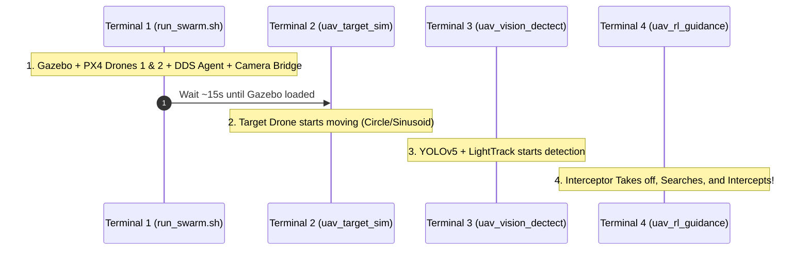

# 📋 TODO & Step-by-Step Run Guide — စနစ်စတင်မောင်းနှင်နည်း လမ်းညွှန်

> ဤလမ်းညွှန်သည် **Autonomous Intercept Drone** စနစ်တစ်ခုလုံး (Gazebo Sim, Dual PX4 SITL, Target Sim, YOLO + LightTrack Perception, နှင့် Guidance Node) ကို ကွန်ပျူတာပေါ်တွင် အစအဆုံး အဆင့်ဆင့် Build လုပ်ပြီး မောင်းနှင်ပုံ (Execution Workflow) ဖြစ်ပါသည်။

---

## ၁။ စနစ် လိုအပ်ချက်များ (Prerequisites & Dependencies)

အသုံးမပြုမီ အောက်ပါ Tools များနှင့် Packages များ စက်ထဲတွင် ရှိမရှိ စစ်ဆေးပါ-

* **OS**: Ubuntu 22.04 LTS
* **ROS 2**: Humble
* **Simulator**: Gazebo Harmonic (`gz-sim 8.12.0`)
* **Flight Controller Firmware**: PX4-Autopilot (v1.16)
* **Middleware**: Micro-XRCE-DDS-Agent (v2.4.x)
* **Libraries**: OpenCV, ONNX Runtime C++, Eigen3, GeographicLib, `apache2-utils` (`rotatelogs` အတွက်)

```bash
# ၁။ လိုအပ်သော utility packages များ သွင်းပါ
sudo apt update
sudo apt install -y apache2-utils libgeographic-dev ros-humble-geographic-msgs
```

---

## ၂။ ပထမဆုံးအကြိမ် ပြင်ဆင်ခြင်း (Initial Setup — One-Time Only)

PX4 Simulation ထဲတွင် ဤ Project ၏ Custom World (`grass_world`) နှင့် Multi-drone script တို့ကို အသုံးပြုနိုင်ရန် ဖိုင်များကို PX4 directory သို့ ကူးထည့်ပေးရပါမည်:

```bash
# Autonomous_Intercept_Drone လမ်းကြောင်းသို့ သွားပါ
cd /home/hmue_gyi/Desktop/Git/Autonomous_Intercept_Drone

# ၁။ Custom grass_world.sdf ဖိုင်အား PX4 Gazebo worlds သို့ ကူးယူပါ
cp assets/gazebo_world/grass_world.sdf ~/PX4-Autopilot/Tools/simulation/gz/worlds/

# ၂။ Dual-drone startup script အား PX4-Autopilot အောက်သို့ ကူးယူပြီး executable လုပ်ပါ
cp run_swarm.sh ~/PX4-Autopilot/
chmod +x ~/PX4-Autopilot/run_swarm.sh
```

---

## ၃။ ROS 2 Workspace အား Build လုပ်ခြင်း (Colcon Build)

```bash
cd /home/hmue_gyi/Desktop/Git/Autonomous_Intercept_Drone

# Build အားလုံး ပြုလုပ်ပါ
colcon build --symlink-install

# သို့မဟုတ် သီးခြား Package တစ်ခုချင်းစီ Build လုပ်လိုပါက
# colcon build --packages-select uav_common_msg px4_msgs
# colcon build --packages-select uav_vision_dectect uav_vision_png uav_rl_guidance uav_target_sim

# Environment Setup လုပ်ပါ
source install/setup.bash
```

> [!TIP]
> Terminal အသစ်ဖွင့်တိုင်း သို့မဟုတ် Command များ မ run မီ `source install/setup.bash` ကို အမြဲ ဦးစွာ run ပေးရပါမည်။ (သို့မဟုတ် `~/.bashrc` ထဲ ထည့်သွင်းထားနိုင်ပါသည်)။

---

## ၄။ စနစ်စတင်မောင်းနှင်ခြင်း အဆင့်ဆင့် (Execution Steps)

Node အချင်းချင်း မှန်ကန်စွာ ချိတ်ဆက်မိစေရန် အောက်ပါအတိုင်း **Terminal (၄) ခု ခွဲ၍ အစဉ်လိုက်အတိုင်း** Run ပေးရပါမည်:



---

### 🖥️ Terminal 1: Simulation ပတ်ဝန်းကျင်နှင့် ဒရုန်းများ စတင်ခြင်း

ဤ Script သည် Gazebo Server, MicroXRCEAgent, Drone 1 (Interceptor), Drone 2 (Target) နှင့် Camera Bridge တို့ကို တစ်ပြိုင်နက် မောင်းနှင်ပေးပါသည်:

```bash
cd ~/PX4-Autopilot
./run_swarm.sh
```

* **စောင့်ဆိုင်းရန်**: Gazebo Grass World အပြည့်အစုံ Load ဖြစ်သည်အထိ **၁၅ စက္ကန့်ခန့်** စောင့်ပါ။
* **အောင်မြင်မှု ပြသချက်**:
  * MicroXRCEAgent port 8888 စတင်မည်။
  * Drone 1 (Instance 1) သည် $(0, 0)$ တည်နေရာတွင် စတင်မည်။
  * Drone 2 (Instance 2) သည် $(20, 0)$ တည်နေရာတွင် စတင်မည်။
  * Camera Bridge က `/camera/image` သို့ ပုံရိပ်များ ပို့ပေးမည်။

---

### 🖥️ Terminal 2: ပစ်မှတ် ဒရုန်း လှုပ်ရှားမှု စတင်ခြင်း (Target Simulator)

Terminal အသစ်တစ်ခု ဖွင့်ပြီး ပစ်မှတ်ဒရုန်း (Drone 2) ကို လှုပ်ရှားပျံသန်းစေမည့် Node ကို run ပါ:

```bash
cd /home/hmue_gyi/Desktop/Git/Autonomous_Intercept_Drone
source install/setup.bash

# Mode 1: မူရင်း စက်ဝိုင်းပုံ ဝိုင်းပတ်ပျံသန်းခြင်း (Default: Uniform Circle)
ros2 run uav_target_sim uav_target_sim

# သို့မဟုတ် Mode 2: လှိုင်းတွန့် ပျံသန်းစေလိုပါက (Sinusoidal Evasion)
# ros2 run uav_target_sim uav_target_sim --ros-args -p motion_mode:=sinusoidal -p max_range:=10.0

# သို့မဟုတ် Mode 3: ကျပန်း ပျံသန်းစေလိုပါက (Random Walk)
# ros2 launch uav_target_sim target_sim.launch.py motion_mode:=random_walk
```

---

### 🖥️ Terminal 3: ကင်မရာမှ ပစ်မှတ်ရှာဖွေခြင်း (Perception Node)

Terminal အသစ်တစ်ခု ဖွင့်ပြီး YOLOv5 နှင့် LightTrack Tracker ကို စတင်ပါ:

```bash
cd /home/hmue_gyi/Desktop/Git/Autonomous_Intercept_Drone
source install/setup.bash

ros2 run uav_vision_dectect uav_vision_dectect
```

* ဤ Node သည် `/camera/image` ကို ဖတ်ယူပြီး ပစ်မှတ်ကို ရှာတွေ့ပါက Bounding Box `[x, y, w, h]` အား `/camera_detect_result` သို့ ထုတ်ပေးပါမည်။

---

### 🖥️ Terminal 4: လိုက်လံတိုက်ခိုက်ဖမ်းဆီးခြင်း (Guidance Node)

Terminal အသစ်တစ်ခု ဖွင့်ပြီး Guidance စနစ်ကို စတင်ပါ:

#### နည်းလမ်း (က) — Reinforcement Learning (GRU Policy) ဖြင့် Run ခြင်း (အဓိက နည်းလမ်း ⭐)
```bash
cd /home/hmue_gyi/Desktop/Git/Autonomous_Intercept_Drone
source install/setup.bash

ros2 launch uav_rl_guidance rl_guidance.launch.py
```

#### နည်းလမ်း (ခ) — Classical PNG နည်းလမ်းဖြင့် Run ခြင်း (ရိုးရိုး သင်္ချာနည်းလမ်း)
```bash
cd /home/hmue_gyi/Desktop/Git/Autonomous_Intercept_Drone
source install/setup.bash

ros2 run uav_vision_png uav_vision_png
# သို့မဟုတ်
# ros2 launch uav_vision_png vision_png.launch.py
```

---

## ၅။ စနစ် ကောင်းမွန်စွာ လည်ပတ်နေခြင်း ရှိ/မရှိ စစ်ဆေးခြင်း (Verification & Telemetry)

စနစ် မောင်းနှင်နေစဉ် Terminal အသစ်တစ်ခုမှ အောက်ပါ Command များဖြင့် အခြေအနေကို စစ်ဆေးနိုင်ပါသည်-

```bash
# ၁။ Topic များ ရောက်ရှိနေမှု စစ်ဆေးခြင်း
ros2 topic list | grep -E "camera|detect|px4_1"

# ၂။ Camera Image FPS စစ်ဆေးခြင်း (ပုံမှန်အားဖြင့် 15 ~ 30 Hz ရှိသင့်သည်)
ros2 topic hz /camera/image

# ၃။ Detection Bounding Box ထွက်နေခြင်း ရှိ/မရှိ စစ်ဆေးခြင်း
ros2 topic echo /camera_detect_result

# ၄။ Interceptor Drone သို့ သွားနေသော အမြန်နှုန်း အမိန့်များ စစ်ဆေးခြင်း
ros2 topic echo /px4_1/fmu/in/trajectory_setpoint
```

---

## ၆။ စနစ်ကို ပြန်လည်ပိတ်သိမ်းခြင်း (Shutdown & Cleanup)

စမ်းသပ်မှု ပြီးဆုံးပါက Simulation Process များ နောက်ကွယ်တွင် ငြိတွယ်ကျန်ခဲ့ခြင်း မရှိစေရန် အောက်ပါအတိုင်း သန့်ရှင်းပေးပါ:

1. **Terminal 1** တွင် `Ctrl + C` နှိပ်ပါ။ (`run_swarm.sh` သည် process များကို အလိုအလျောက် သတ်ပေးပါသည်)။
2. အခြား Terminal 2, 3, 4 များတွင်လည်း `Ctrl + C` ဖြင့် ပိတ်ပါ။
3. အကယ်၍ Gazebo သို့မဟုတ် PX4 process များ မသေဘဲ ကျန်နေပါက အောက်ပါ Command ဖြင့် အပြီးသတ် သတ်နိုင်ပါသည်:

```bash
killall -9 px4 gz-sim gz-server gz-client MicroXRCEAgent parameter_bridge 2>/dev/null || true
```

---

## ၇။ အဖြစ်များသော ပြဿနာများနှင့် ဖြေရှင်းနည်းများ (Troubleshooting & FAQ)

| အမှားအယွင်း (Error) | အကြောင်းရင်း | ဖြေရှင်းနည်း |
|---|---|---|
| `rotatelogs: command not found` | `apache2-utils` မရှိသေးခြင်း | `sudo apt install apache2-utils` ကို run ပါ |
| `ERROR: model not found at GDUT_UAV.onnx` | Model file path မှားယွင်းနေခြင်း | `uav_vision_dectect/src/uav_topic_subscrib.cpp` ထဲရှိ Model Path အား စစ်ဆေးပြင်ဆင်ပါ |
| `Gazebo world not found: grass_world` | World file အား PX4 ထဲ မထည့်ရသေးခြင်း | အခန်း (၂) အတိုင်း `cp assets/gazebo_world/grass_world.sdf ~/PX4-Autopilot/Tools/simulation/gz/worlds/` ကို ပြုလုပ်ပါ |
| `MicroXRCEAgent: address already in use` | ယခင် Agent process မသေသေးခြင်း | `killall -9 MicroXRCEAgent` ကို run ပါ |
| Drone က Standby Altitude သို့ မတက်ခြင်း | Offboard mode မဝင်နိုင်ခြင်း | PX4 arm မဖြစ်မီ EKF2 / GPS တည်ငြိမ်ရန် စက္ကန့်အနည်းငယ် စောင့်ပါ |
